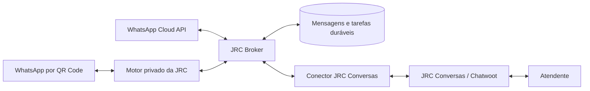

# JRC Broker, JRC Conversas e Meta — funcionamento e próximos incrementos

**Revisão de 15/09/2026.** Base: código desta cópia, plano mestre, telas informadas e documentação primária. O pedido atual é entender o funcionamento. Não foram configurados ativos Meta, criadas caixas no Chatwoot ou enviadas mensagens reais nesta revisão.

## 1. Resultado da conferência

- **QR Code:** o ciclo de conexão funciona, mas o adaptador JRC ainda não implementa a ingestão e o envio de mensagens desse canal na mensageria canônica.
- **Chatwoot:** falta o conector de ida e volta. Não há um webhook JRC pronto para colar no JRC Conversas.
- **Meta:** existe implementação de Embedded Signup, persistência de tokens, registro do número, webhook e mensageria. A configuração do aplicativo JRC e a homologação externa continuam pendentes.
- **Chaves JRC:** existem emissão, listagem e revogação. A lista mostra o prefixo público; o segredo aparece apenas na emissão. Atualmente as chaves autorizam funções de conexões e gestão de chaves, não mensageria ou onboarding Meta.

A URL recebida é `https://jrcconversas-lab.jrcws.cloud/app/accounts/1/crm/dashboard`. Ela indica a conta 1. A consulta pelo navegador chegou à tela de login; versão instalada, caixas, permissões e suporte a assinatura de webhooks não foram verificados dentro da conta.

## 2. Papel de cada sistema



**O conector e o caminho de mensagens QR acima são o desenho alvo, ainda pendente.** O broker cuida dos canais, armazenamento, encaminhamento e tentativas; o Chatwoot oferece caixas de entrada, conversas e atendimento humano.

Vínculo proposto: **empresa JRC → conta Chatwoot; conexão WhatsApp → caixa de entrada**. Não associar automaticamente todas as empresas à conta 1. Caixas diferentes dentro da mesma conta não comprovam isolamento entre empresas: as permissões da instalação precisam ser avaliadas.

## 3. Como será a integração com o Chatwoot

1. Definir a empresa JRC correspondente à conta do Chatwoot.
2. Criar uma caixa do tipo **API** para a conexão.
3. Configurar no servidor do broker a URL do Chatwoot, Account ID, Inbox ID e uma credencial com o acesso necessário.
4. Cadastrar no Chatwoot o callback gerado pela integração JRC.
5. Receber mensagens do WhatsApp, persistir no broker e criar/reutilizar contato, conversa e mensagem na caixa correta.
6. Receber o evento da resposta do atendente, persistir uma tarefa de saída e enviá-la pelo canal vinculado.

O canal API do Chatwoot oferece callback; sua API usa `api_access_token` e possui entidades de contato, conversa e mensagem. [Guia oficial do canal API](https://www.chatwoot.com/hc/user-guide/articles/1677839703-how-to-create-an-api-channel-inbox).

### Existem três fluxos de webhook

| Origem → destino | Uso | Estado atual |
|---|---|---|
| Motor QR → broker | Receber mensagens e estados do WhatsApp por QR | Falta implementar a rota e a normalização JRC |
| Meta → broker | Mensagens e estados oficiais | Rota `/v1/webhooks/meta` implementada; exige configuração e exposição HTTPS |
| Chatwoot → broker | Respostas e eventos do atendimento | Falta implementar o conector e seu callback |

No sentido **broker → Chatwoot**, o conector usa a API para criar contatos, conversas e mensagens. A URL do dashboard não recebe esses eventos.

Contrato sugerido para o callback Chatwoot, **ainda não implementado**:

```text
POST https://<DOMINIO_PUBLICO_BROKER>/v1/integrations/chatwoot/<ID_DA_INTEGRACAO>/events
```

O identificador da integração serve para localizar a configuração; não substitui autenticação. As mensagens de saída devem ser identificadas por evento, tipo, conta e caixa. Notas privadas e eventos espelhados não podem voltar ao WhatsApp. A API documenta a diferença entre `incoming`, `outgoing` e `private`. [Contrato de mensagens do Chatwoot](https://developers.chatwoot.com/api-reference/messages/create-new-message).

A documentação atual do Chatwoot descreve assinatura HMAC com `X-Chatwoot-Timestamp` e `X-Chatwoot-Signature`. Devemos verificar essa capacidade na versão do laboratório antes de habilitar o callback. O conector deverá validar assinatura sobre o corpo original, janela temporal e vínculo da caixa; deduplicar eventos; limitar tentativas e registrar falhas. [Assinatura de webhooks](https://developers.chatwoot.com/api-reference/webhooks/add-a-webhook).

## 4. As credenciais são diferentes

| Credencial | Quem emite | Finalidade |
|---|---|---|
| Chave de API JRC | Broker, na empresa ativa | Um sistema externo chama as rotas autorizadas da JRC |
| Token Chatwoot | JRC Conversas | O conector chama a API de contatos, conversas e mensagens |
| Autorização/token Meta | Meta, após autorização dos ativos | O broker opera o número oficial autorizado |
| Segredo de webhook | Configuração da integração | Verificar a origem e integridade dos eventos recebidos |

Exemplo **atualmente suportado** por uma chave JRC com `instances:read`:

```http
GET /v1/instances?limit=20
x-jrc-api-key: SUA_CHAVE_COMPLETA
```

A chave completa não usa o prefixo isoladamente. Se o segredo foi perdido, emita uma nova chave, atualize o consumidor e depois revogue a anterior. `api_keys:manage` é uma permissão administrativa e não precisa ser concedida apenas para consultar conexões.

Novas permissões de mensagens e webhooks exigirão contratos e verificações próprios. Chaves existentes não receberão essas permissões automaticamente. Não reutilizar senha de cliente nem JWT de uma sessão de navegador como credencial permanente do conector.

## 5. Como a JRC passa a oferecer WhatsApp oficial

Para o produto atender empresas clientes, o caminho a preparar é **Tech Provider**, com aplicativo da JRC e Embedded Signup. Ter uma conta no Facebook for Developers é o ponto de partida; não significa que o aplicativo já esteja liberado para clientes externos.

Preparação: verificar a empresa, vincular o app, configurar WhatsApp e Login for Business, domínio HTTPS e política de privacidade; criar a configuração do cadastro integrado; solicitar revisão/acesso apropriado para `whatsapp_business_management` e `whatsapp_business_messaging`; publicar após cumprir as exigências mostradas no painel. [Referência oficial da Meta](https://github.com/fbsamples/business-messaging-sample-tech-provider-app#going-to-production).

Outras permissões, como `business_management`, devem ser avaliadas conforme o fluxo usado. A coleção oficial reúne cenários diferentes, inclusive compartilhamento de crédito, que não deve ser tratado como uma etapa universal. [Embedded Signup da Meta](https://www.postman.com/meta/whatsapp-business-platform/documentation/du6gzjv/embedded-signup).

### O fluxo já preparado no código JRC

1. Responsável entra no broker e inicia a conexão oficial.
2. O navegador abre a autorização Meta.
3. O cliente escolhe o portfólio empresarial, a conta WhatsApp Business (WABA) e o número.
4. A Meta devolve um código temporário. O servidor JRC troca o código, valida os ativos e guarda a autorização cifrada.
5. O backend registra o número e verifica as pendências disponíveis de conta, pagamento, permissões e assinatura de eventos.
6. Após testes de envio e recebimento, o canal pode ser vinculado ao JRC Conversas pelo conector a implementar.

O cliente mantém seus ativos. Um número já utilizado no aplicativo do celular requer avaliar o fluxo de migração ou coexistência disponível para esse cenário antes de alterar seu cadastro.

### Por que a tela está aguardando configuração

`createMetaOnboardingService` só habilita o fluxo com `META_APP_ID`, `META_APP_SECRET`, `META_SIGNUP_CONFIG_ID`, `META_GRAPH_VERSION` e `META_TOKEN_ENCRYPTION_KEY`. O webhook também precisa de `META_WEBHOOK_VERIFY_TOKEN` e App Secret. Esses valores são configuração de servidor; não são a chave gerada na tela “Chaves de API”.

Callback que deverá ser registrado no aplicativo Meta, quando houver domínio e configuração:

```text
https://<DOMINIO_PUBLICO_BROKER>/v1/webhooks/meta
```

Este caminho existe no código. O domínio público do broker ainda não foi definido aqui. `127.0.0.1` não é um endereço que a Meta consiga chamar no computador da JRC. A URL do Chatwoot é de outro serviço.

Algumas páginas do Meta for Developers exigiram login ou retornaram 429 nesta consulta. Foram usadas a referência pública oficial da Meta e sua coleção oficial; a situação do aplicativo privado da JRC será conferida quando seus dados forem disponibilizados.

## 6. Conferência dos requisitos de infraestrutura e operação

| Requisito | O que existe nesta base | O que falta para atender integralmente |
|---|---|---|
| Persistência | PostgreSQL, mensagens, inbox/outbox transacionais e volumes; caminho Meta implementado | Concluir mensagens QR e Chatwoot; backup instalado, cópia externa e restauração ensaiada |
| Alta disponibilidade | Reinício de containers e verificações de saúde | Replicação/failover de banco, redundância de serviços e teste de queda; a composição atual tem uma instância de cada serviço |
| Escalabilidade | Workers separados e claims com lease e `SKIP LOCKED` | Medir carga, automatizar partições, escalar workers e garantir um único dono por sessão QR |
| Segurança | Isolamento por empresa, papéis, escopos, CSRF, tokens cifrados e HMAC Meta | Homologar HTTPS/borda pública e aplicar autenticação equivalente aos novos conectores |
| DLQ | Estados FAILED/UNKNOWN e mecanismo interno de retry seguro | Fila de falhas de integração, política de tentativas, consulta e reprocessamento auditado |
| Roteamento | Empresa, canal, contato e conversa | Regras por etiquetas/filas e destinos múltiplos |
| ACK | Webhook Meta responde após ingestão; deduplicação e leases | ACK durável nos novos conectores; recuperação e reconciliação ponta a ponta |
| Fila / Pub-Sub | Outbox de trabalho persistente | Assinaturas e entregas independentes para múltiplos consumidores |
| Controle de fluxo | Quotas por empresa, limite de pendências e trabalho limitado por rodada | Limites por destino, tratamento de 429, backoff e pausa de consumidores lentos |
| Agendamento | Campo interno `available_at` na outbox | API/tela para agendar, cancelar, tratar fuso e acompanhar execução |
| Dashboard | Empresas, estados e contagens operacionais | Taxa de mensagens, idade da fila, atraso por destino e latência medida |
| Métricas e alertas | Health e contagens | Séries temporais, alertas configurados e notificação de incidentes |
| Purge / mover | Não há operação visual de purge/redrive | Ações por tarefa, controle de permissão e auditoria; preservação do histórico |
| Rastreabilidade | IDs JRC, IDs externos, estados e request IDs | Busca transversal e linha do tempo de cada tentativa entre broker, provider e Chatwoot |

Persistência em disco não é, sozinha, tolerância à perda do servidor. O tempo máximo aceitável de perda de dados e o tempo para recuperar a operação precisam de metas e ensaios. A política de backup dos documentos anteriores é proposta, não uma rotina já instalada.

### O que significa confirmar uma mensagem

- **Recebida pelo broker:** evento validado e salvo; pode sair da fila de recepção conforme a política.
- **Aceita pelo provedor:** pedido aceito para processamento e, quando disponível, ID externo registrado.
- **Entregue/lida no WhatsApp:** estado confirmado pelo evento correspondente.

Esses marcos são diferentes. Confirmar uma tarefa não significa apagar o histórico. Se o envio pode ter ocorrido e a resposta se perdeu, reenviar automaticamente pode duplicar a mensagem; o estado UNKNOWN exige reconciliação.

## 7. Ordem de construção proposta

1. **Mensageria comum para QR e Meta:** contrato de canal compatível com o legado, entrada QR autenticada, envio de texto e persistência antes do ACK.
2. **Conector JRC Conversas:** vínculo empresa/conta/caixa, tokens cifrados, recebimento e resposta, assinatura, deduplicação, proteção contra loops e notas privadas.
3. **Operação das entregas:** tentativas por destino, backoff, DLQ, pausa e reprocessamento auditado; rastreio por ID.
4. **Homologação Meta:** app JRC configurado, autorização de ativos dedicados, registro, webhooks, texto/templates e revogação testados.
5. **Recuperação e escala:** backup/restore, quedas de processo/banco, retomada sem duplicação, capacidade e alertas medidos.

Critério do primeiro piloto: uma mensagem autorizada entra pelo WhatsApp, permanece após reiniciar o worker, aparece na caixa correta do JRC Conversas e recebe uma resposta; repetir com duas empresas e provar que mensagens, contatos e credenciais não cruzam entre elas. Este cenário ainda não foi executado.

## 8. Evidências no código

- [Autenticação da chave JRC](apps/api/src/http/plugins/authentication.ts): cabeçalho `x-jrc-api-key`.
- [Escopos atuais](packages/contracts/src/api-keys/schemas.ts) e [autorização de mensageria](apps/api/src/http/routes/messaging.ts).
- [Contrato atual de mensagens](packages/contracts/src/messaging/schemas.ts): canal público ainda específico de Meta.
- [Worker](apps/api/src/modules/messaging/worker.ts) e [outbox/repositório](apps/api/src/modules/messaging/repository.ts).
- [Webhook Meta](apps/api/src/http/routes/meta-webhooks.ts) e [ingestão](apps/api/src/modules/messaging/ingest.ts).
- [Onboarding](apps/api/src/modules/meta-onboarding/service.ts) e [cliente Graph](apps/api/src/modules/meta-onboarding/graph.ts).
- [Composição de implantação](infra/dokploy/compose.yaml) e [backup/recuperação](docs/operations/dokploy-saas.md).

As telas de chaves e conexão oficial receberam orientações para tornar essas diferenças visíveis. A revisão não habilita os conectores pendentes nem altera as credenciais existentes.

Validação das orientações: **20 testes aprovados** nas páginas ApiKeys/MetaConnect, compilação TypeScript e build aprovados, scanner do bundle sem achados e revisão visual do portal. Os testes usam respostas controladas e não representam homologação Meta/Chatwoot.
