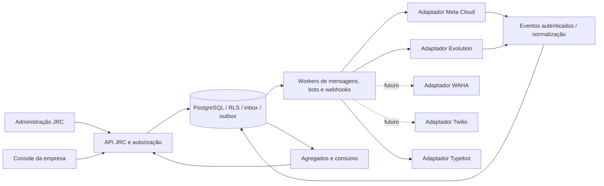

# Plano mestre validado — JRC WhatsApp Broker
**Versão 2.0 · 15/09/2026 · Base: pacote de continuação de 14/09/2026**

**Atualização posterior no mesmo dia:** o cliente passou a ver somente os canais JRC por QR Code e WhatsApp Oficial. Foram criadas duas empresas locais e validado o isolamento no PostgreSQL real. Consulte [a atualização de clientes de teste](ATUALIZACAO-CLIENTES-TESTE-20260915.md); as constatações abaixo descrevem a entrega inicial e permanecem históricas onde essa atualização as complementa.

## 1. Parecer

A arquitetura do plano 1.0 é adequada: produto próprio JRC, monólito modular em TypeScript/Fastify, React/Vite, PostgreSQL com isolamento por empresa e workers separados. O visual enviado é viável sobre essa base. A execução precisa distinguir a refatoração da console, a conclusão da mensageria e os módulos comerciais/IA.

**Esta entrega refatora a console e acrescenta indicadores no backend. Não conclui todas as fases F0–F9 do produto nem homologa provedores externos.** O catálogo funcional e os IDs do [plano original preservado](docs/reference/PLANO-MESTRE-JRC-BROKER-v1.md) continuam válidos, com os ajustes e a ordem abaixo.

Os documentos recebidos foram tratados como referências históricas. A autorização para a refatoração local vem do pedido atual. Nenhuma mensagem real foi enviada, nenhuma sessão WhatsApp foi pareada/reiniciada e nenhum serviço de produção foi alterado.

## 2. Reconciliação da base

- O ZIP de continuação contém 1.064 arquivos; cada um foi comparado por SHA-256 com a entrada equivalente do ZIP maior. Todos são idênticos.
- O pacote maior acrescenta dependências, cache e arquivos gerados. Ele não representa outra versão desses 1.064 arquivos.
- A implementação foi feita em uma cópia nova. Os arquivos de Downloads e os demais projetos JRC foram preservados.
- Os ZIPs não trazem o histórico Git nem o gitlink do submódulo. A cópia recebeu um repositório local isolado, sem commits, para não herdar o Git da pasta pai.
- Licenças, atribuições e o código upstream foram preservados. A verificação do gitlink continua pendente; não foi criado um apontamento artificial apenas para aprovar o teste.
- O comparativo `COMPARATIVO-BROKERS-2026-09-14.md`, citado no plano 1.0, não está nos arquivos fornecidos. Foram usados os comparativos presentes em `docs/operations/console-broker-modulos.md`, os planos do pacote, o código e as fontes oficiais consultadas nesta revisão.

## 3. O que mudou nesta entrega

| Tela da referência | Implementação desta entrega | Limite explícito |
|---|---|---|
| 1. Dashboard executivo | Cards, distribuição dos estados, volume diário, provedores, atalhos e seletor de 7/30/90 dias | Dados da empresa ativa; agregação global JRC continua separada |
| 2. Conexões | Tabela, busca, filtro por estado, exportação CSV, acesso ao detalhe e importação | Filtros e exportação cobrem os registros carregados; a UI informa quando há mais páginas |
| 3. Detalhes | Nova identidade visual nos controles existentes de perfil, contadores, configurações e operações | Sem inventar taxa de entrega, departamento ou histórico completo |
| 4. Providers | Catálogo Meta/Evolution/WAHA/Twilio, comparação e atalhos utilizáveis | WAHA e Twilio identificados como planejados; Ligo é referência de produto |
| 5. Provisionamento | CSV, prévia, escolha de conta, confirmação contextual e resultado por linha | Até 100 nomes; execução na sessão do navegador; pareamento individual posterior |
| 6. Health Center | Estados atuais, falhas de envio, resultados incertos e últimas operações com falha | Sem SLO, monitoramento contínuo, latência inventada ou incidentes falsamente “abertos” |
| 7. Uso e custos | Consumo diário, quotas reais, limites e estado da empresa | Custo monetário fica indisponível até existir conciliação financeira |
| 8. Relatórios e BI | Volume diário, entrega confirmada, erros e CSV com os mesmos dados da tela | Sem SLA de atendimento, custos por departamento ou percentuais de período anterior sem fonte |
| 9. JRC Brain | Diagnóstico por regras usando indicadores da empresa e links para investigação | Não é um chat com IA; assistente generativo e execução de ações continuam no backlog |

Também foram preservadas as jornadas de mensagens/Typebot, Meta, API keys, empresa e administração. O tema comum alcança os formulários existentes. A administração global `/jrc` mantém autenticação própria; não recebeu acesso irrestrito por meio da nova console.

### Backend entregue

`GET /v1/organization/overview?days=7|30|90`:

- Autentica a sessão JWT e usa a organização da identidade, com revalidação de membership pelo mecanismo existente.
- Recusa API key nesta rota de console, período inválido e tentativa de escolher outra organização por query string.
- Executa a consulta dentro da transação de tenant existente; filtros explícitos por organização complementam RLS.
- Agrega canais Baileys e canais Meta, mensagens por dia e até dez operações com falha/resultado incerto.
- Seleciona somente agregados e identificadores operacionais públicos. Não retorna conteúdo, números, tokens ou endereços privados do motor.
- Retorna contrato Zod validado e documentação OpenAPI atualizada. Erro de banco recebe resposta sanitizada.
- Usa uma instrução SQL para manter consistência do snapshot. A execução dessa consulta em PostgreSQL real ainda exige homologação no ambiente de teste.

### Regras dos indicadores

- “Online/prontas” reúne estado CONNECTED das instâncias Baileys e READY das conexões Meta; não é comprovação de entrega nem teste contínuo de disponibilidade.
- Canais Meta antigos sem registro de prontidão ficam em “Sem estado”.
- O período inclui o dia corrente e os N−1 dias anteriores em UTC, agrupando pela criação da mensagem.
- Entrega confirmada = estado atual DELIVERED ou READ das saídas criadas no período. A taxa divide esse número pelas saídas aceitas; sem saídas, mostra “—”.
- Mensageria que ainda não passa pelo armazenamento canônico JRC não entra nos relatórios.
- Operações FAILED/UNKNOWN no período são registros históricos; a tela não presume que permanecem incidentes abertos.
- Faturas, custos, disponibilidade histórica e latência não foram aproximados a partir de contagens.

## 4. Onde entram Ligo, Evolution, WAHA e Twilio

| Referência | Papel na solução | Decisão técnica |
|---|---|---|
| Ligo | Experiência de bots, integração com atendimento, conhecimento e relatórios | Usar como benchmark de jornadas. Não é necessário contratar ou colocar Ligo entre a JRC e o WhatsApp |
| Evolution API | Motor atualmente encapsulado pelo adaptador BAILEYS | Priorizar a conclusão de eventos e envio canônicos; manter engine privada |
| WAHA | Motor alternativo com API de sessões e eventos | Criar adaptador independente somente após o contrato genérico e um cenário de uso real |
| Twilio | Fornecedor de WhatsApp oficial | Adaptador opcional, distinto de Meta Cloud direta, com credenciais, remetentes e callbacks próprios |
| Meta Cloud API | Canal oficial integrado diretamente à JRC | Concluir onboarding, templates, estados e homologação |
| Typebot | Editor/runtime de fluxos inicial | Concluir a integração nos dois tipos de canal antes de construir um editor próprio amplo |

**Evidências e limites da comparação, consultados em 15/09/2026:**

- A página pública da [Ligo](https://ligo.cloud/plataforma/bots/) descreve blocos, transferência humana, IA com arquivos, relatórios e integrações. É uma referência de produto; presença na página não comprova desempenho ou execução na JRC. A inspeção privada anterior mencionada no plano não foi repetida.
- Os [recursos documentados da Evolution](https://docs.evolutionfoundation.com.br/evolution-api/configuration/available-resources) incluem texto, mídia e outras operações, com listas em homologação e botões fora da API em nuvem descontinuados. A documentação atual e o snapshot local fixado em commit devem ser confrontados por versão antes de liberar recursos.
- A [matriz WAHA](https://waha.devlike.pro/docs/how-to/engines/) distingue motores e recursos; a documentação alerta que respostas e eventos podem variar. O adaptador deve fixar motor/versão e normalizar seu contrato.
- A [documentação Twilio](https://www.twilio.com/docs/whatsapp/api) descreve remetentes, webhooks, templates e a janela de atendimento. O uso de um fornecedor oficial não elimina a necessidade de controlar autorização dos ativos, consentimento, templates e status na JRC.
- A [API Typebot](https://docs.typebot.com/api-reference/chat/start-chat) fornece início de conversa. O fluxo deve manter a sessão por empresa/canal/conversa, continuar a execução e converter somente os blocos realmente suportados.

A recomendação de priorização é uma decisão de engenharia baseada no código disponível e nas dependências; não é um benchmark de velocidade, preço ou disponibilidade entre fornecedores.

## 5. Arquitetura alvo e fronteiras

1. Conexão, capacidade de envio e saúde são estados separados.
2. Toda conversa/mensagem tem ID JRC; IDs externos permanecem vinculados a empresa, provedor e canal.
3. Credenciais ficam no backend, cifradas ou referenciadas. Não expor chaves globais ou o painel privado do motor ao cliente.
4. Não alternar automaticamente um número entre Meta, Evolution, WAHA e Twilio após erro. Migração é operação explícita.
5. PostgreSQL é a fonte durável para inbox/outbox. Redis coordena limites e notificações. O plano antigo menciona RabbitMQ; sua adoção continua condicionada a uma necessidade medida e à definição de um único fluxo de trabalho durável.
6. A UI deve consultar as capacidades efetivas do canal, não a lista comercial de recursos do fornecedor.
7. Empresa, unidade e departamento são entidades diferentes. A empresa define o tenant; unidades e filas precisam de entidades/permissões próprias. Não usar nome do canal como substituto definitivo.
8. Provisionamento de cadastros é distinto de pareamento e de campanha de mensagens.
9. JRC Brain para análise da operação é distinto de agentes que conversam com clientes. Ambos precisam de autorização e auditoria próprias.
10. Não reescrever autenticação/RLS/worker por causa de uma alteração visual.

## 6. Principal dívida técnica confirmada no código

- `packages/providers/src/contracts/provider.ts` modela o ciclo da conexão BAILEYS/META.
- `apps/api/src/modules/messaging/types.ts` ainda exige `phoneNumberId` e `wabaId` em todos os canais.
- `apps/api/src/modules/messaging/worker.ts` resolve somente cliente Meta.
- `apps/api/src/modules/messaging/dispatcher.ts` combina despacho com preflight de templates Meta.
- `packages/contracts/src/messaging/schemas.ts` publica o canal como `provider: META`.
- Typebot está vinculado a essa mensageria. Não basta criar um card WAHA ou Evolution para conectar bots e inbox.

Essas partes foram preservadas nesta refatoração para não disfarçar uma migração de dados incompleta como integração pronta. Elas definem o primeiro incremento funcional a executar na sequência.

## 7. Ordem recomendada para concluir o broker

| Incremento | Escopo e arquivos centrais | Critério de aceite |
|---|---|---|
| R0 — Console e base | Entrega atual; restaurar proveniência Git/submódulo e ambiente de banco isolado | Build reproduzível; testes de arquivo e integração documentados; revisão visual |
| R1 — Canal genérico | Contrato separado de mensageria/capacidades; migração compatível de `messaging_channels`; resolver por canal | Canais Meta existentes continuam legíveis; não criar campos Meta fictícios para Baileys |
| R2 — Evolution ponta a ponta | Ingestão autenticada, deduplicação, texto, outbox, eventos e histórico | Mensagem de teste entra, persiste, aparece na tela e recebe resposta; timeout não causa reenvio cego |
| R3 — Meta e mídia | Homologação do onboarding/templates, mídia privada, status fora de ordem | Jornada real com conta/número dedicados; credencial revogada bloqueia envio |
| R4 — Typebot e atendimento | Sessões por conversa, conversão de saídas, pausa humana e retomada; filas/atribuição | Mesmo fluxo nos canais homologados; takeover impede resposta automática tardia |
| R5 — Escala operacional | Lotes persistentes no servidor, webhooks assinados, retry/DLQ, sondagens e incidentes | Fechar navegador não perde o lote; recuperação de worker e falhas ensaiadas |
| R6 — Conectores opcionais | WAHA primeiro se houver demanda de motor; Twilio se houver demanda de fornecedor oficial | Testes de contrato e homologação próprios, incluindo normalização e autenticação de eventos |
| R7 — Financeiro/BI | Ledger de uso, tarifas versionadas, reconciliação, dimensões unidade/departamento | Sem dupla contagem/cobrança; total conciliável com registros do fornecedor |
| R8 — Brain generativo | Consulta autorizada de métricas, explicação com fontes, ferramentas restritas e avaliações | Nenhuma consulta entre tenants; ações não executadas apenas porque um texto de cliente as pede |
| R9 — Piloto e operação | Carga sintética, backup/restore, canário, observabilidade e runbooks | Metas medidas no ambiente declarado, números dedicados e cliente piloto |

Mapeamento para o plano original: R0 cobre parte de F0/F1 e da console; R1/R2 correspondem ao núcleo F2; R3 à F3; R4 à F4/F5; R5 inclui F2/F9; R6 à F7; R7 à F8; R8 à F6; R9 à F9. O trabalho de segurança e recuperação acompanha cada incremento.

## 8. Especificação do próximo incremento: R1/R2

### Contratos

- Canal: `id, organizationId, provider, providerAccountId, providerReference, connectionState, readiness, capabilities`.
- Credenciais e referências privadas não entram no DTO público.
- Mensagem: ID JRC, canal, conversa, origem, tipo de conteúdo, chave idempotente, estado e referência externa opcional.
- Resultado do adaptador: aceito com ID externo, rejeitado com erro canônico, falha confirmadamente anterior ao envio ou resultado incerto.
- Template permanece uma capacidade específica. Seu preflight sai do dispatcher genérico e fica no adaptador oficial.
- Rotas `/v1/instances` e `/v1/messaging` permanecem compatíveis; novos aliases públicos dependem de uma migração explícita dos consumidores.

### Persistência e execução

1. Migração aditiva com backfill Meta; índices e chaves compostas garantem isolamento.
2. Evento autenticado resolve o canal no servidor. O payload não escolhe o tenant.
3. Inbox é persistida e deduplicada antes de confirmar recebimento.
4. Mensagem/outbox são gravadas atomicamente; worker revalida lease, canal, consentimento e dono da conversa.
5. Envio ocorre fora da transação; resultado incerto não entra em retry automático.
6. Atualizações de status respeitam ordem lógica e origem. Histórico importado não dispara bot.
7. Typebot só passa a Baileys após esse caminho estar coberto por testes.

### Cenários mínimos

Duas empresas; API key sem escopo; canal errado; webhook inválido/repetido; status fora de ordem; duas entradas simultâneas; timeout antes/depois da possível aceitação; queda após envio; worker reiniciado; suspensão/revogação; takeover humano; perda de sessão Typebot. Depois, cenário real de baixo volume com números dedicados.

## 9. Provisionamento: limites e evolução

A entrega atual cria cadastros usando a API existente, com chave idempotente por linha e execução sequencial. O usuário revisa o conteúdo antes da criação. Se a resposta for incerta ou falhar, o lote para; os IDs/chaves podem ser exportados para investigação.

Não há retomada automática depois de fechar a aba, XLSX, associação de números, importação entre tenants, execução em background ou configuração automática de filas/templates/webhooks. Para chegar ao fluxo completo da imagem, construir `provisioning_jobs` e `provisioning_items` com RLS, quotas, validação, lease, cancelamento, progresso e histórico persistentes. O frontend passa a acompanhar esse job.

## 10. Critérios de liberação

- A prévia visual é explicitamente sintética e só existe no Vite de desenvolvimento.
- A release operacional deve usar o build de produção, API, banco migrado e workers configurados.
- Testes HTTP com doubles não substituem ensaio de RLS/migração em PostgreSQL.
- O Docker Desktop instalado está sem engine disponível nesta sessão. PostgreSQL/Redis de teste e credenciais de provedores não foram configurados para esta entrega.
- Não houve homologação externa, teste de carga, restauração de backup, publicação ou rollout.
- Consultar [VALIDACAO-20260915.md](VALIDACAO-20260915.md) para comandos e resultados efetivamente obtidos.

**Decisão final:** evoluir esta base. Priorizar canal genérico + Evolution ponta a ponta; completar Meta/Typebot; depois expandir os fornecedores. O desenho das nove telas já orienta a console, enquanto cada módulo avança com dados, permissões e evidências próprias.
