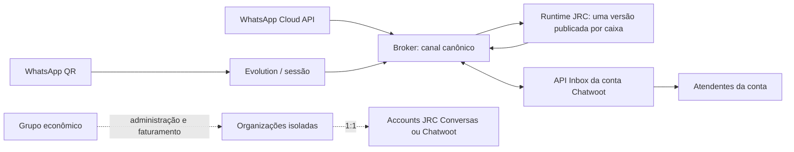

# Broker JRC — auditoria de produto, integração e prontidão comercial

Data: 25/09/2026. Revisão de código baseada no Broker `46e63f459f857211903df47e8e591f27d2434eb0` (incrementos locais em `codex/broker-commercial-readiness-20260925`) e no JRC Conversas `239c8358666289846e6e0112ea6c38eccfd956ba` (`codex/jrc-broker-modules-20260924`). Este documento distingue implementação local, testes e homologação externa. Não é certificado de funcionamento integral nem autorização de deploy.

## 1. Situação verificada

- `main` remota do Broker estava em `b352b8c8242a291059cbbcd3a9dbbc3225bed432`; a branch de imagem `46e63f4` continha as mudanças mais novas auditadas antes desta rodada. `main` remota do JRC Conversas estava em `62c14af884c7f45fa640345556f2ffecc22113d8`, anterior aos módulos QR/Flows da branch `239c835`. Atualizar uma imagem ou fazer deploy da `main` antiga não promove os módulos.
- No Broker, `npm run typecheck`, `npm run build`, `npm run test:web:bundle` e `npm test -- --reporter=dot` passaram; a última execução completa fechou com **1.251 testes em 193 arquivos**. Uma execução anterior teve falha de espera da prévia JSON na interface sob carga; o arquivo isolado passou com 8/8 e a repetição completa passou sem mudar a UI. Trinta e cinco testes focais de QR, Meta e Chatwoot também passaram. A suíte `npm run test:integration` **não foi validada nesta máquina**: faltou `TEST_DATABASE_ADMIN_URL`; 44 arquivos de integração falharam no setup e 265 testes ficaram skipped. Isso não comprova defeito dos contratos PostgreSQL, tampouco os aprova.
- Os testes locais usam fakes/fixtures para integrações externas. Não foi feito pareamento real de WhatsApp, onboarding com WABA Meta real, ida e volta com JRC Conversas/Chatwoot por HTTPS, teste de carga para milhares de sessões ou restore no servidor.
- As capturas de 25/09 mostram 503 em grupos, caixas e automações. O código mostra causas possíveis diferentes, mas a causa de **cada** 503 só pode ser confirmada pelos logs da requisição correlacionada e pelo estado do schema/flags no servidor. Não inferir uma causa única a partir do aviso genérico da interface.

Correções de código preparadas nesta rodada: (a) normalização e aviso de layout para imports n8n com coordenadas fora do canvas, nós desabilitados permanecem inertes e imports de 150 nós conservam um bloqueio de revisão sem exceder o limite, comprovados por testes e pelos três JSONs do pacote; (b) probe estrutural de schema alinhado às migrations 0030/0031 para `/ready` e Saúde operacional; (c) Compose configurável para domínio, identificadores de stack/Traefik e Chatwoot exclusivamente externo. Não houve alteração de frontend nem deploy; essas correções ainda precisam da integração PostgreSQL e da promoção de release.

## 2. Arquitetura de referência



O Broker é dono do transporte WhatsApp, das credenciais de provider, do canal, do vínculo com a inbox, da execução da automação e do retorno de mensagens. JRC Conversas/Chatwoot é dono da Account, inbox, contatos, conversas, agentes e trabalho humano. A integração deve manter `1 organization_id Broker ↔ 1 account_id Chatwoot/JRC`, com N canais/inboxes da mesma empresa. Um grupo econômico apenas reúne organizações para administração; não é fronteira de dados nem papel de superadmin para seus membros.

Exemplo: `Grupo JRC` contém GoPure, Construtora e Operadora. Cada empresa recebe organização Broker e Account JRC distintas; um agente que atende as três ganha três memberships explícitas e os grants nas respectivas inboxes. `Casa do Construtor` pode ter uma Account com várias inboxes se as filiais compartilham agentes e política de dados; filiais isoladas jurídica/operacionalmente devem ter Accounts/organizações próprias. O grupo não deve reutilizar token, número ou flow entre tenants.

## 3. Matriz de capacidades

| Capacidade | Implementação encontrada | Estado de aceite comercial |
|---|---|---|
| WhatsApp QR | Adapter Evolution com criar, conectar, consultar estado, desconectar e remover no provider; fachada de canais e webhook assinado. | **Parcial.** Contratos locais testados; JRC repete `POST pair` com mesma idempotency key por até 60 s quando o QR atrasa, mas falta consulta persistente do desafio e prova real de pareamento, reconciliação e escala multi-engine. |
| WhatsApp oficial | Embedded Signup, cifra de token, webhook e envio via Cloud API. | **Parcial.** Exige aplicativo/configuração Meta e homologação real por ativo. Ausência dessas configurações bloqueia onboarding; não é resolvida com token inventado. |
| Templates Meta | Listagem de templates aprovados e envio onde aplicável. | **Lacuna.** Não há fluxo completo de criar, submeter, acompanhar rejeição/aprovação e editar versão na interface JRC. |
| Destino JRC/Chatwoot | Destino aprovado por empresa, token de conta cifrado, criação ou adoção de API Inbox e substituição explícita de webhook. | **Parcial.** Falta prova de ida e volta real, falhas de callback e compatibilidade por versão do Chatwoot. |
| Módulo QR no JRC | Rails BFF, contexto por Account/Inbox, tela de onboarding e pareamento com grants. A branch `239c835` adicionou adoção local idempotente da API Inbox existente e repetição de `pair` para QR tardio. | **Parcial.** Faltam revisão esperada/handshake remoto na adoção, consulta assíncrona persistente do QR e desvinculação distribuída. |
| Chatwoot de terceiro | API Inbox + callback permitem mensagens sem alterar o servidor do cliente. | **Parcial.** A tela de QR/reconexão **dentro** do Chatwoot dele é outro artefato: módulo/fork do host ou UI incorporada com autenticação curta e backend de controle. Dashboard Apps padrão aparecem na conversa, não são automaticamente um wizard em Configurações → Caixas de entrada. |
| Automation Studio Broker | Rascunho, validação, simulação, publicação, versões, binding, worker, outbox e histórico existem. | **Parcial.** Catálogo/runtime e formulários do editor não têm cobertura equivalente para todos os nós; teste com provider real e ownership conjunto faltam. |
| Importação n8n | JSON é reconhecido e salvo como rascunho com relatório. | **Não equivale a execução do n8n.** O conversor mapeia somente Webhook/ExecuteWorkflowTrigger, RespondToWebhook literal e NoOp; outros tipos ficam `unsupported` e bloqueiam publicação. O caso mostrado nas capturas (1/62 compatível) é compatível com essa limitação. |
| Flow dentro do JRC | Módulo `jrc_flows` local existe na branch JRC dos módulos. | **Não integrado ao runtime Broker.** Faltam sessão delegada, editor Broker no host, owner único por inbox, handoff/retomada e migração real dos flows da central. |
| Grupo econômico | Migration 0031 e painel global agrupam organizações. | **Administrativo somente.** Não criam subtenants, não herdam permissões e não dão visão cruzada de conversas para agentes. |
| Operação em milhares de QR | Worker de mensagens, PostgreSQL, Redis e Evolution têm limites básicos. | **Não demonstrado.** Compose tem um Evolution 2 CPU/2 GiB, volume local e endpoint único; faltam placement/roteamento de sessão, HA e benchmarks. |

## 4. Lacunas prioritárias de integração

### P0 — recuperar observabilidade e operação do deploy atual

1. Confrontar commit/branch do Compose Dokploy, digest **em execução** da API e WEB, e versão da migration no banco. O serviço `migrate` está sob perfil `maintenance`; mudar as imagens não executa 0031 automaticamente. A tela de grupos consulta as novas tabelas de 0031, portanto a migration ausente é hipótese forte para essa tela, não diagnóstico confirmado dos demais 503.
2. A base auditada declarava `SCHEMA_CURRENT` ao encontrar somente `operational_heartbeats`; `/ready` verificava outra tabela antiga. **Correção local nesta rodada:** ambos agora exigem objetos das migrations recentes, incluindo triggers/FK de 0030 e RLS/policy de 0031, e o indicador chama-se `SCHEMA_REQUIRED_OBJECTS_PRESENT`. É checagem estrutural, não comparação do journal/hash. Continuar usando `db:schema:status` com credencial migradora como gate exato; o teste PostgreSQL do novo probe ainda depende de `TEST_DATABASE_ADMIN_URL`.
3. `AUTOMATION_RUNTIME_V2_ENABLED` tem padrão `false` no Compose. Sem ele, as rotas de automação v2 podem devolver `AUTOMATION_RUNTIME_DISABLED`/503. Ativar somente após schema, cofre, sandbox e workers estarem prontos; confirmar a resposta real pelos logs/código da requisição.
4. A lista e o detalhe de canais também deram 503 nas capturas. Esses endpoints não dependem da flag de automação; investigar por `requestId` na API, transação/RLS, provider e schema. Não trocar segredos nem recriar a instância sem evidência.

### P1 — produto WhatsApp e atendimento

1. **QR:** completar Q3 sobre a adoção local já existente: confirmar revisão esperada e estado remoto antes de persistir, evitar colisão/alteração concorrente, consultar operação de pareamento assíncrona até QR/código/erro, confirmar identidade, permitir reconexão e desvinculação com estado persistente. Não apagar a inbox nem o histórico na desconexão. A repetição temporária de `POST pair` na UI não substitui um endpoint de consulta da operação.
2. **JRC Conversas:** completar A1/A2 com sessão delegada curta do usuário autenticado para a organização/Account e editor JRC único. A chave de controle QR não autoriza automações. Completar A3 com owner `LOCAL_LEGACY` ou `BROKER` por inbox, revisão monotônica e fence/drain; o listener local não deve executar quando o Broker for owner. Completar A4 com estado humano/retomada, callbacks idempotentes e reconciliação.
3. **Chatwoot externo:** entregar um pacote instalável e versionado para o host do cliente: backend proxy/BFF por Account, armazenamento cifrado da chave restrita, grant de pareamento por Inbox, tela QR/reconexão, status assíncrono e revogação. A ponte API Inbox continua transportando mensagens independentemente da presença da tela. Testar a versão exata do Chatwoot do cliente.
4. **Meta:** finalizar autorização do App JRC e dos WABAs, revisão de permissões e onboarding guiado, templates com criação/submissão/status, mídia, limites e reconciliação. Separar claramente no produto canal oficial e QR, com restrições comerciais diferentes.

### P1 — Automation Studio JRC próprio

O objetivo comercial é construir nós e fluxos de forma low-code, inclusive casos representativos de n8n, sem usar o runtime do n8n e sem prometer importação universal do JSON bruto. Cada nó JRC precisa do mesmo contrato em quatro lugares: schema de parâmetros, formulário visual, validador/publicador e executor durável. Hoje o catálogo anuncia mais tipos do que o inspetor configura integralmente; vários nós de dados/expressão exibem só o destino. Isso torna um fluxo aparentemente editável, mas não publicável ou não útil.

O pacote real informado pelo usuário em `JRC_CORRECAO_v1_1_13` foi inspecionado **somente por metadados e pelo conversor local**, sem copiar payloads ou credenciais para o Git. O workflow principal tem 62 nós: 27 Code, 11 Switch, 7 Redis, 6 Execute Workflow, 3 Agent, 3 modelos OpenAI, 2 If, 1 Respond to Webhook, 1 Sticky Note e 1 Webhook; 11 nós referenciam credenciais, 47 usam expressões e há conexão `ai_languageModel` além de `main`. Os dois subflows têm 38 e 52 nós, incluindo HTTP Request e Wait. Reproduzi um erro adicional: as coordenadas n8n dos dois subflows excediam o limite do canvas JRC, lançando `ZodError` antes de criar o rascunho. A normalização corrigida mantém as coordenadas distintas, preserva distâncias usuais e avisa sobre o ajuste; canvases extremos são comprimidos para o limite do editor. Executei o conversor compilado nos três arquivos: **1/62**, **1/38** e **1/52** nós, respectivamente, foram classificados `PARTIAL`; os demais são `UNSUPPORTED`, mais um bloqueio de revisão por rascunho. Não executei esses flows em produção nem importei as credenciais. A ausência de configuração no ENV não transforma esses nós em compatíveis.

| Nó n8n encontrado nos três arquivos | Ocorrências | Semântica JRC necessária para equivalência |
|---|---:|---|
| Code | 72 | Converter lógica caso a caso para nós declarativos ou JavaScript isolado com contratos de entrada/saída e limites; não executar o código original com acesso ao host. |
| Switch / If | 14 / 12 | Saídas nomeadas/múltiplas, ordem das regras, operadores e expressões; o `condition` binário atual não equivale automaticamente ao Switch. |
| Redis | 13 | Operações permitidas por tenant, escopo de chave, TTL, idempotência e credencial controlada; não expor o Redis de infraestrutura aos flows. |
| Execute Workflow / Trigger | 6 / 2 | Resolver IDs de subflow para automações JRC versionadas, mapear parâmetros, resultado e erro; trigger isolado pode virar início, chamada não. |
| HTTP Request | 21 | Método, URL, headers/body, autenticação do cofre, expressão de parâmetros, timeout/retry, ramificações de erro e proteção de rede. |
| Agent / modelo OpenAI | 3 / 3 | Contrato de modelo/ferramentas e aresta `ai_languageModel`, limites de custo, credencial de tenant, histórico e resultado observável. |
| Wait, Webhook e Respond to Webhook | 1 / 1 / 1 | Espera durável, evento autenticado, resposta correlacionada e timeout; converter apenas quando a semântica de espera/resposta for idêntica. |
| Sticky Note | 3 | Preservar como anotação de editor, sem tratá-la como execução ou obrigar substituição funcional. |

As contagens somam 152 nós, incluindo três gatilhos que hoje recebem tipo JRC. A matriz é uma fila de implementação e testes, não uma declaração de compatibilidade já existente.

Sequência de implementação: (1) sanitizar o pacote real e gerar matriz por `type`/`typeVersion`, parâmetros, expressões, ramificações e referências de credenciais; (2) priorizar adaptadores nativos de gatilho, condições/switch, variáveis, menu/captura, HTTP, Redis, subflow, wait, webhook, JSON, IA e handoff usados nesses três arquivos; (3) implementar formulários tipados, expression engine isolado, credenciais por referência, depurador/execuções; (4) preservar original/import report e impedir publicação de nós sem semântica equivalente; (5) testar importação, edição, simulação e execução real dos três fluxos completos. Credenciais de origem nunca devem ser importadas automaticamente, e nenhum código arbitrário do nó Code deve receber acesso ao host do Broker.

### P1/P2 — escala e UX

- Criar registro de engines QR e alocação estável `instance → engine`, sem depender de `EVOLUTION_BASE_URL` único. Separar sessão/volume por shard, controlar reinício e reatribuição, medir CPU/RAM por sessão e testar perda de nó. PostgreSQL/Redis do Compose atual também precisam de capacidade, backup e HA mensurados antes de prometer milhares.
- `BROKER_STACK_NAME` e `BROKER_ROUTE_ID` agora permitem isolar projeto Compose e roteadores Traefik em instalações múltiplas; os padrões preservam a stack atual. Definir ambos e `BROKER_HOST` distintos por cliente e validar DNS/certificado, volumes, rede e limites antes de oferecer uma stack por cliente no mesmo daemon.
- Paginar/filtar canais, grupos, inboxes, execuções e logs no backend; o detalhe de canal não deve varrer todos os canais da organização. Definir quotas por tenant e métricas de fila, latência, reconexão, erro e custo por número.
- Nas telas, distinguir claramente estados de **transporte**, **provider**, **destino/inbox**, **bot** e **atendimento humano**. Cada erro deve mostrar código/correlação e ação adequada. O código atual já oferece desconectar/reconectar e arquivar/restaurar canal QR, arquivar/restaurar automação, desvincular bot e excluir vínculo Chatwoot vazio; consolidar essas ações em jornadas consistentes, com permissões, pendências e confirmação de impacto. Não oferecer exclusão física da inbox ou do histórico como sinônimo de desconexão. No importador, agrupar nós incompatíveis por tipo e localizar cada um no canvas, em vez de listar 61 avisos genéricos.
- A prévia de JSON chama `POST /v1/automation-imports` e persiste imediatamente o original cifrado; **Cancelar importação** só limpa a tela. Definir expiração/retention e remoção explícita de artefatos abandonados, com auditoria e sem apagar automações já criadas. A rota de importação é registrada pela presença do cofre, independentemente de `AUTOMATION_RUNTIME_V2_ENABLED`; isso pode permitir upload e depois devolver 503 na criação. A UI deve consultar a disponibilidade antes do upload e a API deve ter um contrato coerente para prévia enquanto o runtime está inativo.
- Substituir campos de UUID manual por seleção autorizada de credenciais e subflows da organização. Expor na UI a gestão de webhooks que já existe na API. Mostrar antes do upload os limites reais: 2 MB no arquivo, 150 nós, 300 conexões e 250 KB no grafo convertido. Vários nós do catálogo `data-*`, `json-*` e `expression` exibem só a variável de destino, enquanto o executor exige outros parâmetros; fechar esse descompasso em formulário, contrato, validação e teste de execução.

## 5. Comparação funcional, sem promessa de paridade total

| Referência | Capacidade documentada oficialmente | Posição atual do JRC |
|---|---|---|
| [Twilio WhatsApp](https://www.twilio.com/docs/whatsapp/api) + [Studio](https://www.twilio.com/docs/studio) | Canal oficial, webhooks, templates e construtor visual versionado de comunicação. | Broker possui partes do transporte Meta e studio, mas faltam homologação Meta, templates gerenciados e editor/runtime validado por jornada real. Não cobre o portfólio multicanal/voz da Twilio. |
| [Ligo Bots](https://ligo.cloud/plataforma/bots/) | Blocos visuais, transferência humana, templates, relatórios e bots em vários canais; a [plataforma](https://ligo.cloud/plataforma/) inclui módulos além do WhatsApp. | Há base de canvas, inbox e handoff, mas integração JRC/Broker e experiência de configuração ainda não atingem a jornada completa descrita. |
| [Evolution API](https://github.com/evolution-foundation/evolution-api) | Sessões WhatsApp e integrações diretas, inclusive Chatwoot, webhooks e canais oficial/QR. | O Broker já a usa como motor QR interno. Isso não transforma a JRC em implementação independente do protocolo nem resolve escala por si só. |
| [WAHA Sessions](https://waha.devlike.pro/docs/how-to/sessions/) | Ciclo explícito de sessão, status, QR, reinício, logout e exclusão; sessões persistentes/múltiplas por engine. | Broker tem parte do ciclo no backend, mas UI distribuída e operação multi-engine precisam completar. A referência da WAHA de [500+ sessões](https://waha.devlike.pro/blog/waha-scaling-how-to-handle-500-sessions/) é arquitetura/benchmark do fornecedor, não capacidade automaticamente herdada. |
| [Chatwoot API Inbox](https://www.chatwoot.com/hc/user-guide/articles/1677839703-how-to-create-an-api-channel-inbox) + [Dashboard Apps](https://www.chatwoot.com/hc/user-guide/articles/1677691702-how-to-use-dashboard-apps) | Inbox API e callback para integração; app incorporável na área da conversa. | Conector Broker tem contrato local; módulo QR de administração no host precisa ser construído e instalado separadamente. |

### Empacotamento comercial proposto

| Oferta | Entrega verificável | Dependência ou limite que deve constar na venda |
|---|---|---|
| Broker + JRC Conversas QR | Uma organização/Account por empresa, números por inbox, painel de conexão/reconexão dentro do JRC e atendimento humano. | Liberar após Q3, A1–A4 e jornada HTTPS de duas empresas; QR usa motor Evolution interno e sua capacidade precisa de medição. |
| Broker + Chatwoot próprio do cliente | Conector API Inbox, callback e módulo instalável no Chatwoot para QR, reconexão e estado por inbox. | Qualificar a versão do Chatwoot, política de atualização do módulo, autenticação delegada, suporte e responsabilidade pelo host do cliente. |
| Canal oficial Meta | Onboarding autorizado, WABA/número, entrada/saída e gestão de templates. | Requer App Meta e ativos reais aprovados; custos e limites do provedor são independentes da assinatura JRC. |
| Automation Studio JRC | Editor, catálogo de nós, versionamento, teste, publicação, execução e observabilidade dos nós contratados. | Vender somente os tipos de nó cuja cadeia editor → validador → runtime foi testada; importador n8n é conversão assistida por tipo/versão, não execução de qualquer JSON. |

Definir limites por **empresa** e medir conexões ativas, mensagens, execuções de flow, consumo de IA, mídia e retenção. Grupo econômico é uma dimensão comercial/administrativa acima das empresas, não uma licença para atravessar seus dados. Cobrança e SLA devem refletir a capacidade homologada de cada modalidade QR/Meta e do host Chatwoot externo.

## 6. Configuração e promoção no Dokploy

As variáveis abaixo são **nomes e funções**, não um novo `.env` com segredos. Preserve as chaves de cifra em uso e faça backup; gerar novas chaves sem recifrar dados torna credenciais antigas ilegíveis. Senhas/tokens anteriormente enviados em conversas devem ser rotacionados em cofre antes de oferta comercial.

| Bloco | Variáveis principais | Quando usar |
|---|---|---|
| Imagens/origem | `JRC_API_IMAGE`, `JRC_WEB_IMAGE`, `EVOLUTION_ENGINE_IMAGE`, `PUBLIC_ORIGIN`, `BROKER_HOST`, `BROKER_STACK_NAME`, `BROKER_ROUTE_ID` | Digests imutáveis e HTTPS; `BROKER_HOST` é só o hostname, igual ao host de `PUBLIC_ORIGIN`. Os identificadores únicos evitam colisão de stack/Traefik em outra instalação. Os padrões preservam a instalação atual. |
| Banco/cache | `POSTGRES_PASSWORD`, `JRC_APP_PASSWORD`, `JRC_AUTH_PASSWORD`, `JRC_PLATFORM_PASSWORD`, `EVOLUTION_DB_PASSWORD`, `REDIS_PASSWORD` | Persistir volumes, backup e migration única; URLs internas são montadas pelo Compose. |
| Segurança | `JWT_SECRET`, `REFRESH_TOKEN_HASH_SECRET`, `API_KEY_HMAC_SECRET`, rate-limit HMAC keys, `CHALLENGE_ENCRYPTION_KEY`, `BROWSER_CSRF_SECRET`, `PLATFORM_MFA_KEY`, `INTEGRATION_ENCRYPTION_KEY`, `QR_WEBHOOK_SIGNING_KEY` | Distintas, estáveis e guardadas fora do Git; `PLATFORM_LOGIN_MODE=password_totp` em produção. |
| QR | `EVOLUTION_API_KEY` | Motor privado alcança API/webhook interno; cada sessão pertence a uma organização/canal. |
| Automação | `AUTOMATION_RUNTIME_V2_ENABLED`, `CREDENTIAL_VAULT_KEYS_JSON`, `AUTOMATION_SANDBOX_TOKEN` | Ativar V2 apenas depois do schema e dos workers; vault/sandbox têm chaves próprias, persistentes. |
| JRC/Chatwoot | `CHATWOOT_BASE_URL`, `CHATWOOT_PLATFORM_TOKEN`, `CHATWOOT_EXTERNAL_DESTINATIONS_ENABLED`, `CHATWOOT_CONTROL_ENABLED`, `CHATWOOT_EMBED_ENABLED`, `CHATWOOT_MEDIA_ORIGINS` | URL/token Platform servem ao destino gerenciado; Chatwoot externo usa destino aprovado e token da Account, não o token Platform global. Flags devem refletir o módulo realmente instalado. |
| Meta | `META_APP_ID`, `META_APP_SECRET`, `META_SIGNUP_CONFIG_ID`, `META_GRAPH_VERSION`, `META_TOKEN_ENCRYPTION_KEY`, `META_WEBHOOK_VERIFY_TOKEN` | Exigem App Meta real e ativos autorizados. Não preencher com placeholders e declarar canal pronto. |

Procedimento controlado no host, com backup/restauração ensaiada antes da migration e sem imprimir `.env`:

```sh
docker compose --env-file .env -f infra/dokploy/compose.yaml config --quiet
docker compose --env-file .env -f infra/dokploy/compose.yaml ps
docker compose --env-file .env -f infra/dokploy/compose.yaml --profile maintenance run --rm --entrypoint sh migrate -c 'SCHEMA_STATUS_DATABASE_URL="$MIGRATION_DATABASE_URL" node apps/api/dist/db/schema-status.js'
# Depois do backup e da revisão de compatibilidade, se PENDING:
docker compose --env-file .env -f infra/dokploy/compose.yaml --profile maintenance run --rm migrate
docker compose --env-file .env -f infra/dokploy/compose.yaml --profile maintenance run --rm --entrypoint sh migrate -c 'SCHEMA_STATUS_DATABASE_URL="$MIGRATION_DATABASE_URL" node apps/api/dist/db/schema-status.js'
docker compose --env-file .env -f infra/dokploy/compose.yaml logs --since=30m api worker automation-worker automation-io-worker scheduler-worker evolution
```

O resultado esperado do status para a revisão Broker auditada é `CURRENT`, 31 migrations e versão `0031_economic_groups`. Nunca colar o resultado de `docker compose config` sem `--quiet` em chamado: ele pode expandir segredos. Relacionar cada 503 da UI ao `requestId` no log da API e registrar código/stack saneados. Só depois atualizar as imagens pelo digest validado e exercer rollback de aplicação compatível. A branch Git do Dokploy mostrada anteriormente era antiga; confirme qual Compose ele carrega antes de promover a revisão. No JRC Conversas, `239c835` está em branch e não na `main` remota; uma publicação própria, suas migrations e testes devem ser planejados em conjunto.

## 7. Critérios de aceite antes de vender cada oferta

1. **Broker + QR + JRC Conversas:** duas empresas isoladas; criar/adotar inbox existente → QR tardio → identidade confirmada → entrada → bot publicado → handoff → resposta humana → retomada → desconexão/reconexão; sem duplicação/perda, segredos no browser ou bot duplo.
2. **Broker + QR + Chatwoot externo:** instalar módulo no host real do cliente, validar grants de administrador/agente, API Inbox e callback, troca de token, revogação, webhook já ocupado e versões suportadas. Desinstalar o módulo não pode apagar conversas nem a instância Broker inadvertidamente.
3. **Meta oficial:** App JRC aprovado, WABA/número de piloto, Embedded Signup, webhook, entrada/saída, mídia, template submetido/aprovado/rejeitado e revogação; custos e limites transparentes por empresa.
4. **Automação JRC:** cada tipo de nó vendido é configurável no editor, validado, executado e observável; JSON n8n piloto convertido com relatório claro e sem `unsupported` antes da publicação. Testar waits, crash/retry/idempotência, credenciais, branch/loop seguro e rollback de versão.
5. **Escala:** testar 100, 500 e 1.000 sessões de laboratório em shards, carga de mensagens e falha de engine/worker/PostgreSQL/Redis; medir p95 de entrada e QR, memória, recuperação, backlog, RPO/RTO e custo por conexão. Só anunciar número comercial que o teste no ambiente alvo sustentar.

## 8. Ordem de execução recomendada

1. Diagnóstico de produção por digest, status 0031, flags e request IDs; corrigir falso verde do schema. Não alterar credenciais por tentativa.
2. Concluir Q3 e ciclo de vida distribuído do QR entre Broker e JRC, partindo da adoção local e do retry de QR já presentes na branch `239c835`.
3. A1/A2 sessão delegada e editor único; A3 owner único/fence; A4 handoff/retomada. Migrar `jrc_flows` reais por preview, corte e rollback.
4. Fechar importador/editor a partir do JSON n8n representativo e testar o workflow inteiro, sem executar nós desconhecidos.
5. Produto Chatwoot externo: contrato de instalação e módulo QR administrável, com testes na versão do cliente.
6. Meta real, gestão de templates, observabilidade, paginação e arquitetura multi-engine, seguidos por homologação/carga/restore e release por digest.

Nenhuma dessas etapas fica concluída pela simples existência de botões, por testes unitários isolados ou por configuração de ENV. O compromisso comercial deve declarar apenas as capacidades que passaram pela jornada correspondente.
