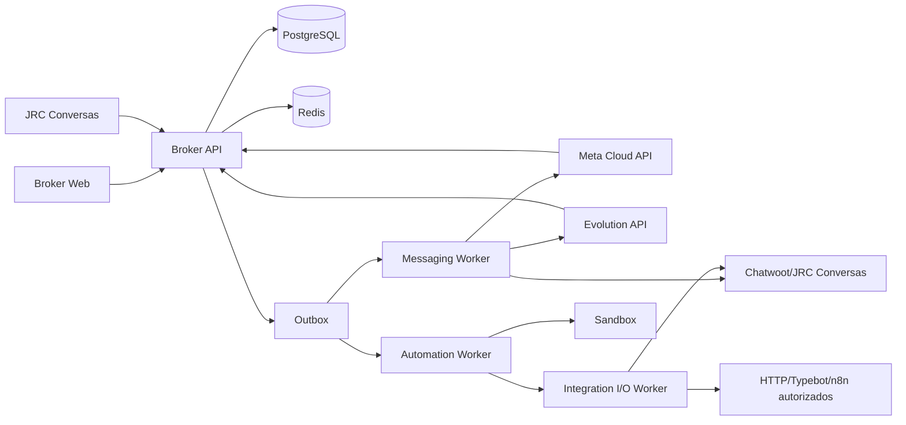

# 12 — Arquitetura alvo

## Componentes

## Autoridades

- Broker: organizações, canais, credenciais, automações, execução, auditoria e roteamento.
- JRC Conversas/Chatwoot: inbox, agentes, conversas, atendimento humano e canais não transportados pelo Broker.
- Provedores: entrega e estado do transporte.

## Pipeline de eventos

1. Adaptador valida autenticidade e normaliza o evento.
2. Router resolve tenant, canal, contato/conversa e idempotência.
3. Política decide automação, entrega humana ou ambos conforme estado explícito.
4. Runtime grava transição e efeitos desejados na mesma transação.
5. Outbox distribui efeitos aos workers.
6. Resultado atualiza execução, métricas e auditoria.

## Princípios

- PostgreSQL é a fonte de verdade; Redis coordena filas, locks e dados efêmeros.
- Nenhum broker de eventos adicional entra antes de evidência de volume ou retenção que o exija.
- Todo efeito externo é repetível com idempotência.
- Contratos OpenAPI e eventos versionados precedem troca da UI.
- Compatibilidade é feita por adaptadores temporários, com data e critério de remoção.

