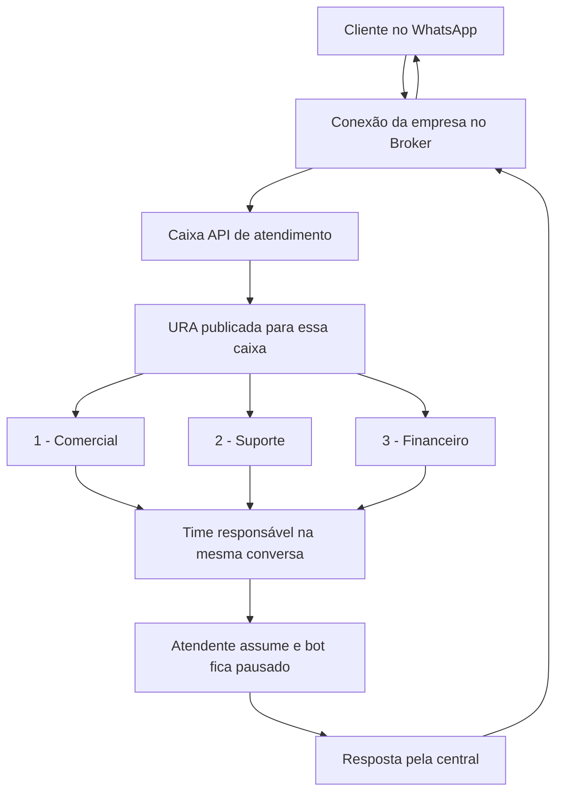

# Chatbots, caixas e atendimento no JRC Broker

Data da revisão: 29/09/2026. **Estado: diagnóstico e desenho de implementação; não é uma certificação da produção.**

> **Decisão posterior do usuário:** concluir e homologar tudo no Broker antes dos módulos Flow e QR embutidos. O [plano Broker primeiro](../superpowers/plans/2026-09-29-broker-first-completion.md) passa a definir a ordem de desenvolvimento; a análise técnica abaixo permanece como evidência. Qualquer menção a delegação em paralelo neste diagnóstico está substituída por essa decisão.

## 1. Resposta operacional

O vínculo deve ser explícito: **empresa → conexão/número → caixa de atendimento → fluxo publicado → destino humano**. Na experiência a concluir, as novas conversas elegíveis daquela caixa entram no bot configurado; cada conversa mantém seu próprio estado. Uma resposta do cliente continua o passo em espera, não reinicia o menu a cada mensagem. Durante atendimento humano, o bot permanece parado até uma retomada autorizada.

Uma caixa pode receber clientes diferentes e encaminhá-los a times distintos sem mudar de caixa. Exemplo proposto:

O desenho acima expressa a experiência pretendida. O Broker já implementa o transporte e partes da execução, mas a atribuição remota e a retomada ainda precisam ser concluídas no motor atual.

## 2. O que significa cada configuração

| Elemento | Função no atendimento | Onde configurar |
| --- | --- | --- |
| Grupo econômico | Agrupa empresas comercialmente; não concede acesso cruzado | Administração do Broker |
| Empresa | Limite de dados, credenciais, planos e operação | Broker; correspondência explícita com Account da central |
| Account | Ambiente de atendimento com caixas, contatos, agentes e times | JRC Conversas/Chatwoot |
| Conexão WhatsApp | Transporte associado ao número | Broker, para canais administrados pelo Broker |
| Caixa de entrada | Local de entrada e histórico do canal na central | Integração Broker + caixa API correspondente |
| Fluxo/URA | Sequência de mensagens, perguntas, decisões e encaminhamento | Editor responsável pela automação |
| Robô/AgentBot | Registro de um serviço externo que recebe eventos da caixa | Robôs e Configuração do Bot, quando o modo de integração usa AgentBot |
| Time | Grupo que assume a conversa, como Comercial ou Suporte | Central; selecionado pelo bloco de transferência |
| Agente | Usuário humano responsável por atender | Central, com permissões e vínculos adequados |
| Fila de atendimento | Conversas aguardando atendimento, por exemplo do time sem agente atribuído | Central; regras de distribuição precisam ser definidas |
| Etiqueta/atributo | Classificação e dados estruturados do atendimento | Central; o Flow deve permitir selecionar e atualizar |
| Automação da central | Regras de evento, condições e ações | Configurações → Automação |
| Macro/resposta pronta | Atalho operacional aplicado pelo atendente | Central |
| Fluxo de Conversa mostrado nos prints | Resolução de conversas por inatividade | Configurações → Fluxo de Conversa; não é o canvas de bots |

Um time pode atender várias caixas. A existência de um time não garante fila FIFO, posição ou previsão de espera; essas capacidades exigem regras e evidência próprias. [Documentação de times](https://www.chatwoot.com/hc/user-guide/articles/1677492970-adding-teams).

As regras de automação da central não substituem, por si só, o estado de uma conversa com perguntas e respostas. Devem coexistir com o bot sem disputar saudação, transferência e encerramento. [Automação do Chatwoot](https://www.chatwoot.com/hc/user-guide/articles/1677689800-how-to-use-automation).

**Grupo JRC:** se GoPure, Operadora JRC e Construtora JRC precisam de isolamento, modelar empresas distintas no mesmo grupo e Accounts distintas na central. Se a operação for deliberadamente compartilhada, uma empresa/Account com várias caixas e times é uma alternativa, mas times não equivalem a isolamento entre empresas. O modelo atual do Broker prevê uma organização para uma Account; não vincular três organizações independentes à mesma Account sem redesenhar e testar essa fronteira.

## 3. Três mecanismos diferentes: transporte, robô e editor

### 3.1 Transporte da caixa API

O Broker recebe o evento do WhatsApp, registra a mensagem e a entrega à caixa API vinculada. A resposta pública criada na central volta pelo callback da caixa e é enviada ao WhatsApp. O contrato de caixa API distingue mensagens de entrada e saída e exige que o conector crie os registros necessários. [Canal API](https://www.chatwoot.com/hc/user-guide/articles/1677839703-how-to-create-an-api-channel-inbox).

No Broker auditado, o callback gerado é `/v1/integrations/chatwoot/:integrationId/events`. Usar sempre a URL produzida pela versão instalada; não montá-la a partir do trecho visível de um print. Esse callback tem função e verificação próprias.

Uma caixa nativa WhatsApp, Facebook, Instagram ou e-mail já existente na central **não passa automaticamente a usar o Broker**. A ponte atual seleciona caixas `Channel::Api`. Suporte do novo motor a caixas nativas por eventos AgentBot exige um adaptador específico, homologado por canal.

### 3.2 AgentBot

O caminho oficial é cadastrar o serviço em Robôs e associá-lo em Caixa → Configuração do Bot. Isso aponta a caixa para um serviço executor; não constrói o fluxo. O modelo documentado usa `pending` para atendimento pelo bot e `open` para passagem ao humano. [Agent bots](https://www.chatwoot.com/hc/user-guide/articles/1677497472-how-to-use-agent-bots).

**Não copiar o webhook de transporte para o cadastro de Robô.** O callback do AgentBot é outro contrato. No serviço legado do Broker ele é `/v1/flows/chatwoot/:bindingId/events`; o novo editor de Automações não usa esse vínculo automaticamente.

O print da caixa com “Selecionar Robô” não prova ausência de automação do Broker: a execução nova é vinculada ao canal. Tampouco selecionar NICO, JRC Demo ou outro robô existente faz a automação do editor novo aparecer nele.

### 3.3 Editor dentro do JRC Conversas

O checkout local JRC possui um Flow próprio, com modelo e execução Rails. Sua rota de editor é `/app/accounts/:accountId/flows`; o menu dos prints em `/settings/conversation-workflow` tem outra finalidade. Não foi comprovado que esse editor esteja habilitado na versão implantada.

O painel embutido atual do Broker oferece consulta/reconexão WhatsApp. Um Dashboard App, por padrão, aparece dentro da conversa; isso não instala um editor administrativo de fluxos. [Dashboard Apps](https://www.chatwoot.com/hc/user-guide/articles/1677691702-how-to-use-dashboard-apps).

A experiência recomendada é **um motor de execução no Broker e duas interfaces para o mesmo fluxo**: console Broker e módulo JRC delegado. Alterar no JRC deve atualizar o mesmo rascunho e as mesmas versões vistas no Broker. Isso ainda precisa ser implementado.

## 4. O que a auditoria confirmou

Revisão estática dos checkouts e prints; nenhuma mensagem, conta, robô ou configuração de produção foi modificada.

| Capacidade | Evidência atual | Consequência |
| --- | --- | --- |
| Vincular Account e caixa API | Serviço valida destino, credencial, tipo da caixa e substituição de callback | Base de transporte existente |
| Espelhar entrada e saída | Fila persistente e mapeamento de contato/conversa | Mensagens do bot novo podem integrar o histórico da central |
| Encaminhar resposta pública | Parser exclui notas privadas e reflexos marcados pelo Broker | Transporte evita essas classes de vazamento/loop |
| Executar automação nova | Vínculo por canal e runtime persistente | Não depende automaticamente do AgentBot da central |
| Transferir no motor novo | HANDOFF muda somente modo local para HUMAN | Falta atribuir time/agente e sincronizar status remoto |
| Reagir a resposta externa | Worker muda conversa local para HUMAN | Hoje não distingue toda resposta de robô externo de resposta humana |
| AgentBot legado | Cria/associa robô, verifica pending e ausência de humano | É outro motor; rotas antigas de UI redirecionam ao editor novo |
| Retornar ao bot | Há funções de retomada parcial; legado mantém marca humana | Falta um ciclo coordenado entre Broker e central |
| Criar nova conversa após resolução | Mirror reutiliza mapeamento existente | Política “nova/reabrir” precisa ser implementada e testada nesse caminho API |
| Flow dentro do JRC | Editor/motor próprios no checkout | Não compartilha o grafo do novo Broker |
| Credencial QR abre Flow | Rotas novas exigem JWT Broker; chave QR rejeitada | Delegação de editor exige credencial e autorização próprias |
| Exclusividade entre motores | Proteções parciais; caminho de binding direto diverge | Ainda não há garantia completa de um executor por caixa |

Referências de código:

- Broker `apps/api/src/modules/integrations/chatwoot-service.ts`: `bindAccount`, `connect`, validação de caixa e callback.
- `apps/api/src/modules/integrations/chatwoot-events.ts` e `chatwoot-worker.ts`: parser de resposta, modo HUMAN, espelhamento e envio.
- `apps/api/drizzle/migrations/0014_chatwoot_integration.sql`: trigger `enqueue_chatwoot_mirror`.
- `apps/api/src/commands/automation-worker.ts:38`: HANDOFF local; linhas seguintes registram saída AUTOMATION.
- `apps/api/src/modules/automations/engine.ts` e `service.ts`: efeito handoff e vínculo por canal.
- `apps/api/src/modules/flows/chatwoot-service.ts`: caminho legado AgentBot.
- `apps/api/src/modules/channels/facade.ts`: revisar binding direto junto à proteção de `messaging/repository.ts`.
- `apps/web/src/pages/AutomationStudio.tsx`: redirecionamento das rotas antigas.
- `apps/api/src/http/routes/automations.ts` e teste `automation-delegation-boundary.test.ts`: fronteira atual de autenticação.
- JRC: `app/controllers/api/v1/accounts/jrc_flows_controller.rb`, `app/jobs/jrc_flows/dispatch_job.rb`, `app/services/jrc_flows/{access,connection_setup,remote_runner}.rb`.
- Desenho existente: [A1/A2 — editor delegado](jrc-flow-delegation-a1-a2-20260925.md).

Base Broker: commit 9466f6a, com correções locais de navegação ainda não publicadas. Checkout JRC: 239c8358; print JRC: v4.16.2 build 9c4f08b. Essas versões diferentes impedem assumir que todo recurso local esteja implantado.

## 5. Passo a passo de configuração e homologação

### Parte existente: preparar o transporte e a operação

1. **Definir a empresa e Account.** Conferir a correspondência no Broker. O ID numérico da Account só tem significado junto ao destino/servidor.
2. **Preparar os atendentes na central.** Criar/convidar agentes, conceder acesso às caixas necessárias e adicioná-los aos times. Definir quem pode administrar e quem apenas atende.
3. **Preparar os times.** Exemplo: Comercial, Financeiro e Suporte; definir distribuição ou tomada manual. Configurar horários, fuso e destino de contingência.
4. **Conectar o número no Broker.** Criar a conexão, concluir autenticação e verificar a identidade/número. “Cadastro criado” e “caixa vinculada” não comprovam conexão WhatsApp.
5. **Vincular a central no Broker.** Informar destino HTTPS aprovado, Account e credencial de usuário com as permissões exigidas. Platform token é uma modalidade de provisionamento, não requisito universal para vincular uma Account existente.
6. **Selecionar conexão e caixa API.** Criar uma caixa API ou adotar uma existente compatível. Se já houver outro callback, apresentar o impacto antes da substituição. Não selecionar uma caixa nativa WhatsApp como se fosse caixa API.
7. **Verificar o caminho completo com contato de teste.** Mensagem recebida na caixa correta; resposta pública entregue ao mesmo cliente; nota privada não enviada; anexos somente nos tipos suportados; repetição do evento sem duplicar conversa/mensagem.

A caixa “WhatsApp Claudio Hideki” dos prints aparece como Canal da API e possui callback do Broker. É um indício de vínculo, não uma comprovação atual dos sete passos.

### Parte que precisa da conclusão do motor de atendimento

8. **Escolher explicitamente quem executa o bot.** Broker, Flow local JRC ou serviço externo. Nunca ativar dois controladores para a mesma caixa. A exclusividade precisa ser validada também no servidor.
9. **Criar um bot nativo simples.** Saudação → menu → captura/condição → transferência para time. Configurar tentativas inválidas, silêncio, horário e contingência.
10. **Validar e simular.** Configuração de blocos, caminhos sem saída, times inexistentes, credencial ausente e campos obrigatórios.
11. **Publicar uma versão e vincular à caixa.** Publicar não deve iniciar envios sozinho. Ativar é operação separada, permitida após checagens de transporte, runtime e atribuição.
12. **Homologar a transferência real.** O time recebe a conversa, um humano assume, o bot para, o histórico continua na mesma caixa e a resposta chega ao cliente.
13. **Homologar retorno e encerramento.** Retomada explícita com ponto definido; cliente que volta após resolução segue a política configurada; uma única pesquisa de satisfação quando aplicável.

Os passos 8–13 são a jornada de aceite a concluir; não representam uma funcionalidade integral já disponível. Não basta habilitar uma variável global para suprir as lacunas da seção 4.

## 6. Como oferecer os dois produtos

### Cliente com Chatwoot próprio

- Compatibilidade verificada por capacidades/API e assinatura na instalação real, não apenas pelo número da versão.
- Cliente prepara Account, agentes/times e permissão da integração.
- Cliente configura canal, caixa e fluxo pelo console Broker.
- Chatwoot permanece como ambiente humano e histórico.
- Se quiser automatizar canais que já entram nativamente no Chatwoot, habilitar futuramente o adaptador AgentBot do motor canônico, com entrada e saída adequadas àquele canal.
- Não prometer instalação de módulo JRC em um Chatwoot padrão apenas por cadastrar uma chave.

### Cliente com JRC Conversas e módulo Flow

- Recomendação: escolher a caixa na central, abrir o editor delegado e operar os mesmos rascunhos, versões, testes e vínculos do Broker.
- Na arquitetura proposta, o servidor JRC deverá autenticar o usuário, verificar Account/caixa/papel e chamar a fachada delegada do Broker.
- A chave de controle WhatsApp/QR não ganha acesso ao Flow; credenciais do serviço ficam no servidor.
- Funções comerciais podem ser habilitadas por plano, mas permissões e saúde operacional continuam verificadas.
- Manter o Flow local existente identificado como motor distinto até migração explícita. Caso continue disponível, Broker opera só transporte naquela caixa e não inicia automação própria.
- Definir migração por caixa com prévia, pausa, tratamento de execuções em andamento e retorno à versão anterior. A integração de exclusividade com esse motor local ainda precisa ser desenvolvida.

## 7. Contrato do atendimento a implementar

### Um executor e uma sessão por conversa

Persistir seleção do executor e revisão do vínculo por empresa/destino/Account/caixa. Todas as rotas de ativação passam pelo mesmo serviço. Reconciliar mudança feita fora do Broker, inclusive associação de outro AgentBot. Cada worker confere a revisão antes de enviar.

O estado deve ser isolado pela empresa, canal/caixa e conversa. Um mesmo contato em caixas diferentes não compartilha automaticamente a sessão. Uma versão publicada é fixada no início do atendimento; nova publicação não altera passos de sessões já em curso sem migração explícita.

### Gatilhos e estados

Proposta de estados de negócio: bot ativo, aguardando resposta, transferência pendente, aguardando humano, humano ativo, resolvido e pausado por administração. Não confundir “aguardando humano” com o status Chatwoot `pending`, usado no modelo AgentBot para o bot.

Entradas elegíveis: mensagens públicas do cliente no canal suportado, sem reflexos/duplicados. Mensagens humanas, privadas, de sistema e do próprio bot não iniciam uma nova URA. Serializar mensagens próximas da mesma conversa, tratar silêncio e resposta inválida com limites claros.

A preferência de nova conversa ou reabertura após resolução deve ser implementada no adaptador API e testada. Reabrir não significa voltar automaticamente ao primeiro bloco.

### Transferência e retomada

1. Marcar transferência pendente e impedir novas respostas automáticas daquela sessão.
2. Garantir existência do mapeamento da conversa remota; não perder encaminhamento porque o espelhamento ainda está na fila.
3. Validar time/agente no catálogo da Account e acesso à caixa.
4. Atribuir e atualizar o status remoto; conferir resultado antes de exibir “encaminhado”.
5. Se ocorrer falha parcial, manter tarefa recuperável e mostrar alerta operacional; não continuar o bot como se a transferência tivesse sido concluída.
6. Resposta/assunção humana invalida saídas automáticas ainda não entregues. A confirmação precisa ser reavaliada antes do envio ao provedor.
7. “Devolver ao bot” é ação explícita, com permissão e destino: continuar passo, voltar ao menu ou iniciar nova sessão. O simples status pending não elimina a necessidade de reconciliar os estados locais.

A API oficial de atribuição documenta precedência de `assignee_id` sobre `team_id`; testar operações e resultados, sem presumir que enviar os dois preenche ambos. [Assign Conversation](https://developers.chatwoot.com/api-reference/conversation-assignments/assign-conversation).

O guia de webhooks ressalva eventos disponíveis no AgentBot. O adaptador deve provar como recebe/reconcilia status e atribuição, validar assinaturas por origem e deduplicar; não acrescentar um segundo webhook sem esse desenho. [Eventos e webhooks](https://www.chatwoot.com/hc/user-guide/articles/1677693021-how-to-use-webhooks).

### Horários, ausência e satisfação

A caixa deve expor horário e fuso ao editor. Definir se o bot atende fora do horário, se apenas coleta dados ou se avisa e encaminha para atendimento posterior. A resposta de ausência deve ter um único responsável. [Horários](https://www.chatwoot.com/hc/user-guide/articles/1777421876-business-hours-and-auto_responder).

Usar o CSAT da central quando o canal e o transporte entregarem o formato corretamente; testar a resolução e evitar pesquisa duplicada no Flow. Uma caixa API com ícone WhatsApp não equivale a uma caixa nativa com todos os recursos de template. [CSAT por caixa](https://www.chatwoot.com/hc/user-guide/articles/1677503828-how-to-enable-csat-surveys) e [CSAT WhatsApp](https://www.chatwoot.com/hc/user-guide/articles/1768303449-whats_app-csat-surveys-in-chatwoot).

## 8. Escopo mínimo de blocos e usabilidade

O produto prioritário é um construtor de atendimento conversacional.

| Grupo | Recursos necessários |
| --- | --- |
| Início | Entrada na caixa, nova sessão, palavra-chave opcional |
| Conversa | Texto, mídia suportada, pergunta, menu textual; botões/listas somente com capacidade confirmada do canal |
| Decisão | Condição, opção inválida, variável, horário/fuso |
| Continuidade | Espera por resposta, prazo, tentativas, voltar ao menu, encerrar |
| Atendimento | Encaminhar a time/agente, pausar bot, etiquetar, preencher atributo, registrar nota interna |
| Consulta | HTTP com credencial selecionada, resposta mapeada e saídas de erro/timeout |
| IA | Instruções, contexto permitido, limites e transferência; integrações/ferramentas previamente autorizadas |
| Diagnóstico | Simulação, resultado por passo, histórico de execução com dados sensíveis ocultos |

Campos usam seletores de caixas, times, agentes, etiquetas, atributos e credenciais da empresa. O cliente não deve copiar IDs nem escrever chamadas Chatwoot para uma transferência comum.

Canvas: arrastar área vazia, zoom pela roda, ajustar visão, localizar início/bloco selecionado, desfazer/refazer, conectar saídas claras e destacar erro. Todo bloco oferecido tem formulário, validação, executor e teste correspondente. Indicar separadamente salvar rascunho, publicar e ativar.

Proposta de assistente: **Empresa e central → Número e caixa → Bot responsável → Time e regras de atendimento → Teste → Ativação**. Exibir três diagnósticos separados: transporte, bot e transferência humana.

JSON JRC documentado e validado deve reproduzir os mesmos blocos do editor. Importação n8n permanece parcial e complementar: recursos reconhecidos são convertidos com relatório, os demais exigem adaptação. Não condicionar o chatbot básico a implementar SQL, JavaScript arbitrário, Redis genérico ou todo o catálogo n8n.

## 9. Ordem revisada de desenvolvimento

| Etapa | Entrega e principais arquivos | Aceite |
| --- | --- | --- |
| P0 | Contrato único do executor e catálogo de atendimento; `channels/facade.ts`, `messaging/repository.ts`, contratos e migração de vínculo | Ativação concorrente por qualquer rota é rejeitada; isolamento de duas empresas/caixas |
| P1 | Handoff, retorno, ciclo resolved/reopen e sincronização; `automation-worker.ts`, serviços automations e integrações Chatwoot | Menu nativo encaminha à equipe, humano assume e bot para; retomada não duplica |
| P2 | Editor de atendimento, seletores e simulador; `FlowCanvas.tsx`, `AutomationStudio.tsx`, catálogo de blocos | Usuário cria URA inteira sem JSON e vê erros por campo/saída |
| P3 | Editor delegado JRC com o mesmo grafo; A1/A2 no Broker + BFF/controller/feature no host | Criar no JRC, abrir no Broker, mesma versão; revogação bloqueia a próxima operação |
| P4 | JSON nativo, exemplos e consultas/IA necessárias ao atendimento | Importar/exportar preserva fluxo; erros e limites testados; nenhum envio por importação |
| P5 | Adaptadores por canal e conversor n8n limitado; migração do Flow local | Compatibilidade demonstrada para cada capacidade anunciada |

P1 e P2 devem ser desenvolvidos como uma entrega vertical inicial, depois de P0: caixa piloto → saudação → menu → time → humano → encerramento. P3 pode avançar em paralelo para edição, mas a ativação delegada depende de P0/P1. Importação não é o caminho crítico.

Para cada incremento, testar o comportamento antes da liberação, migrar sem interromper sessões antigas e manter rollback de versão. Esta revisão não autoriza trocar webhooks, ativar bots ou excluir dados reais para demonstrar o fluxo.

## 10. Matriz de homologação

- [ ] Dois clientes na mesma caixa recebem sessões e respostas independentes.
- [ ] Mesmo cliente em duas caixas não mistura variáveis nem destino.
- [ ] Empresa A não lê nem atribui caixa/time/agente/credencial da empresa B.
- [ ] Mensagem chega à caixa mapeada e inicia uma única sessão elegível.
- [ ] Resposta continua pergunta/menu correto, inclusive após reinício do worker.
- [ ] Opção inválida, silêncio e fora do horário seguem saídas configuradas.
- [ ] Menu Comercial/Suporte/Financeiro atribui o time esperado na mesma conversa.
- [ ] Falta de agente disponível segue política explícita; não informa posição fictícia.
- [ ] Humano assume enquanto bot processa: nenhuma resposta automática posterior indevida.
- [ ] Nota privada, reflexo do bot e evento repetido não geram envio ao cliente.
- [ ] Falha remota na transferência mantém tarefa e estado recuperáveis, sem falso sucesso.
- [ ] Retorno explícito ao bot funciona; mera entrega atrasada não o reativa.
- [ ] Resolução e nova mensagem respeitam criar nova/reabrir e regra de reinício.
- [ ] Horário/fuso, mídia e CSAT têm comportamento comprovado no tipo real de canal.
- [ ] Publicar versão nova não muda sessões antigas sem política explícita.
- [ ] Ativar segundo motor ou mudar AgentBot externamente é detectado antes de responder.
- [ ] Usuário JRC revogado perde acesso ao Flow mesmo com sessão de editor aberta.
- [ ] Logs permitem relacionar mensagem, sessão, versão e encaminhamento, sem expor segredos.

## 11. Resultado desta revisão

Documentação oficial e código mostram que a experiência pretendida é viável, mas faltam partes centrais de integração no produto atual. Containers ativos, caixa marcada pronta, JSON importado e robô cadastrado não comprovam o ciclo completo.

Nenhum runtime foi alterado por este documento. A correção local de navegação permanece separada e ainda não publicada. O plano de low-code deve seguir o escopo de atendimento definido aqui: [plano revisado](../superpowers/plans/2026-09-29-lowcode-funcional.md).

