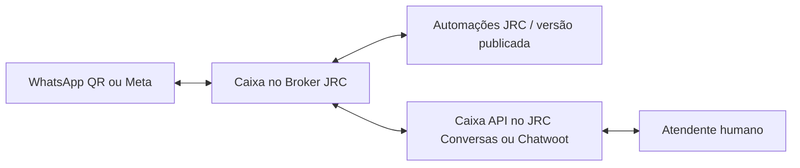

# Broker JRC + JRC Conversas / Chatwoot: jornada e módulos nativos

Data: 23/09/2026. Contratos conferidos no código do Broker desta branch. As telas do host descritas como propostas precisam ser implementadas no repositório da central. Emitir uma chave não instala módulos.

## Estado coordenado dos dois repositórios

Repositórios de continuidade:

- Broker: <https://github.com/ClaudioHideki/BrokerJRCIA>
- JRC Conversas: <https://github.com/ClaudioHideki/jrc-conversas-nico-v12-2-7-comercial-integrado>

Base conciliada do Broker: `f8e81df271670348201998890b56654b1c95bb0c`. A base informada para o desenvolvimento do JRC Conversas no DEV03 é `3b4db70dab1f1fe40bc31a45ebd3f6bfa8cfe7d1`. Esses SHAs identificam as bases de trabalho; não comprovam publicação das imagens nem implantação no servidor.

O DEV03 informou a seguinte validação automatizada conjunta das bases em 23/09/2026:

| Verificação | Resultado informado |
|---|---:|
| Broker — suíte principal, incluindo submódulo | 1.232 testes aprovados |
| Broker — integração com PostgreSQL | 70 testes aprovados |
| JRC Conversas — interface QR/Flows | 26 testes aprovados |
| JRC Conversas — Rails | 38 exemplos, zero falhas |

Os logs detalhados permanecem no ambiente DEV03 em `C:/Users/DEV03/Documents/Jrc/output/conciliacao-dev02-20260923/VALIDACAO-FUNCIONAL-20260923.md`. Os totais acima são evidência informada pelo DEV03 e não foram reexecutados nesta atualização documental. Não houve pareamento WhatsApp real nem jornada conjunta por TLS; portanto, esses resultados validam componentes, não homologação ponta a ponta.

### Entregue na base `f8e81df`

- Jornadas e ações de ciclo de vida da console do Broker revisadas.
- Fachada canônica de canais Meta e QR, com separação entre provider, transporte, automação e atendimento humano.
- Criação/importação de automações em rascunho, revisão de compatibilidade, editor, validação, simulação, publicação, versões, vínculos e execuções.
- Arquivamento/restauração com preservação de histórico e bloqueios para trabalho ativo ou incerto.
- Correção do `claimExecution` PostgreSQL já presente na `main` ancestral.
- Migration `0030_instance_archive.sql`, OpenAPI, testes de API, integração, UI e E2E sintético.

### Próximos incrementos, ainda não implementados integralmente

A ordem coordenada é `Q3 → A1/A2 → A3 → A4`, mantendo QR assíncrono, ciclo de vida e migração/importação no escopo:

1. **Q3 — adoção de caixas existentes:** descoberta restrita à conta, adoção idempotente e consulta assíncrona do desafio de pareamento, sem duplicar inbox nem substituir webhook silenciosamente.
2. **Ciclo de vida distribuído:** desvincular/arquivar por operação persistente, consultar progresso e reconciliar timeouts sem apagar conversas ou histórico.
3. **A1 — identidade delegada:** sessão curta para o usuário autenticado no JRC Conversas, com conta, organização, origem, revisão e escopos mínimos. A chave QR não passa a autorizar automações.
4. **A2 — editor integrado:** núcleo versionado do editor do Broker com cliente, navegação e permissões injetados no frontend da central; sem segundo login ou JWT administrativo compartilhado.
5. **A3 — um motor por caixa:** proprietário explícito `NONE`, `LOCAL_LEGACY` ou `BROKER`, revisão monotônica, bloqueio do motor anterior, drain/reconciliação e confirmação dos dois sistemas.
6. **A4 — handoff e retomada:** coordenação do modo humano com a conversa real na central, cursor/versão explícitos e callbacks idempotentes para atendimento, CRM e NICO.
7. **Migração real de `jrc_flows`:** preview e conversão dos formatos da central para rascunho do Broker. A migração `BROKER_FLOW_V1` não comprova essa conversão.

Os nomes finais dos endpoints novos devem ser congelados primeiro em `packages/contracts` e no OpenAPI. Até isso ocorrer, exemplos de discovery/adoption, sessão delegada, ownership e conversation-control são propostas de contrato, não APIs disponíveis.

### Critério para preparar a publicação

A próxima entrega deve trazer commits identificados dos dois repositórios, testes dos novos contratos e do isolamento entre duas empresas e evidência HTTPS da jornada:

`adotar caixa → gerar QR → conectar WhatsApp → receber mensagem → executar fluxo → transferir ao atendente → responder → retomar automação`

Somente depois dessa homologação serão fechadas migrations adicionais, novas variáveis, Compose e imagens finais. O workflow de imagens continua separado do merge e não deve ser tratado como consequência automática desta documentação.

## Como o conjunto funciona

A caixa no Broker representa o número da empresa. A inbox da central organiza contatos, conversas e atendentes. O vínculo associa as duas. A automação é publicada no Broker e vinculada ao canal. Transferir para humano interrompe as respostas automáticas daquela conversa. Defina um único responsável pela automação de cada caixa para evitar dois bots respondendo ao mesmo evento.

Typebot e n8n são referências e formatos de importação parcial; não são serviços que o cliente precise configurar para o runtime JRC. O serviço que mantém WhatsApp QR é infraestrutura. Meta continua dependente de autorização oficial.

## 1. Operar agora pelo Broker

### Preparação e QR

1. Implantar a versão com estas correções e aplicar a migration 0030. O compose já possui `AUTOMATION_RUNTIME_V2_ENABLED`, com padrão false: habilitar `true` para o runtime próprio. Manter API, workers de mensagens/automação/integração e scheduler saudáveis. Nenhum segredo do servidor foi alterado nesta revisão.
2. Entrar no portal como responsável/administrador da empresa correta. Esse papel não dá acesso global JRC.
3. Abrir `/channels` — Caixas de entrada → Conectar WhatsApp → WhatsApp por QR Code. Dar um nome reconhecível e criar o cadastro.
4. Na caixa, clicar Gerar QR Code. No celular: WhatsApp → Dispositivos conectados → Conectar dispositivo. Renovar o QR se expirar.
5. Esperar Conectado e conferir a identidade do número. Serviço pronto/provisionado não significa WhatsApp conectado.
6. Na própria caixa, seguir para Conectar a central de atendimento e depois Ativar o chatbot.
7. Para desfazer: desvincular automação, pausar atendimento, resolver pendências, desconectar e Arquivar cadastro. Mostrar arquivadas permite restaurar; isso não reconecta automaticamente.

### Associar JRC Conversas ou Chatwoot

1. Abrir `/integracoes`. Confirmar origem HTTPS. Um destino externo precisa estar habilitado e aprovado pela JRC.
2. Vincular ID da conta da empresa na central e token de usuário com acesso às APIs necessárias dessa conta. O Broker verifica a conta e protege o token no servidor.
3. `CHATWOOT_PLATFORM_TOKEN` é usado no provisionamento gerenciado de contas. Não substitui o token de usuário nem é requisito para vincular manualmente uma conta existente.
4. Selecionar conexão WhatsApp e criar uma caixa API, ou escolher uma inbox compatível existente. Só substituir webhook existente com autorização explícita no formulário.
5. Configurar atendentes e conferir conta, inbox e conexão. Para inbox existente, conferir o webhook fornecido pelo Broker.
6. Homologar com contato autorizado: entrada WhatsApp aparece na inbox correta; resposta pública volta ao remetente; nota privada não é encaminhada; testar mídia, eventos duplicados, pausa e retomada.
7. Pausar conserva entregas pendentes. Excluir vínculo sem histórico só permite vínculo desativado/com falha e sem referências. Não exclui inbox/conta remotamente.

Essa ponte API funciona sem módulo de QR instalado dentro da central. Para outros sistemas é necessário um adaptador das APIs/webhooks do Broker ou compatibilidade efetiva com a API de atendimento; não existe conexão universal automática.

### Criar/importar e ativar automação

1. Abrir `/automations` → Nova automação, escolher modelo ou Arquivo JSON.
2. Revisar os blocos exatos, parciais e incompatíveis. Cancelar importação se selecionou o arquivo errado.
3. Importar rascunho e abrir editor. Rascunho incompleto pode ser salvo; não fica publicado nem envia mensagens reais.
4. Ajustar nós, variáveis, credenciais e conexões. Visão geral enquadra coordenadas negativas ou afastadas.
5. Conversões parciais incluem um bloco Revisar importação antes de publicar. Adaptar todos os pontos do relatório antes de removê-lo. Expressões, código, Redis e condicionais externos podem exigir reconstrução com nós nativos.
6. Salvar, Validar e Testar. O simulador não envia WhatsApp nem comprova integração com uma API externa real.
7. Publicar a versão. Voltar à caixa em `/channels`, escolher Automação publicada e Vincular automação.
8. Novas mensagens usam o vínculo/versionamento. Execuções mostra esperas, falhas, cancelamento e reconciliação. Desvincular interrompe novas entradas; execuções iniciadas precisam ser tratadas separadamente.
9. Após handoff, escolher a conversa em `/mensagens` e Retomar bot. Retomar execução terminal não substitui alterar o modo da conversa.
10. Arquivar conserva versões e histórico; conclua/cancele/reconcilie trabalho ativo antes.

Recuperar automações anteriores oferece migração explícita por lote e conserva a origem para rollback. Rascunhos antigos inválidos são recuperáveis para edição; versões inválidas não são promovidas. Conferir vínculos e homologar antes do corte de runtime. O JSON de 62 blocos das capturas não foi recebido integralmente nesta revisão; não há promessa de execução sem adaptações.

## 2. Módulo nativo: Conectar WhatsApp dentro da central

### UX proposta

Adicionar WhatsApp JRC no wizard de caixas de entrada e uma página Conexão WhatsApp em cada inbox vinculada: status, identidade mascarada, gerar/renovar QR, confirmar número, agentes autorizados e desconectar. Não exigir abrir conversa para parear. Administrador configura uma vez; agentes autorizados não recebem chave permanente.

### Implementação necessária no host

- Configuração por conta: origem HTTPS do Broker, organizationId, accountId, destinationRevision e referência de segredo cifrado.
- Vínculo por inbox: conta, inboxId, integrationId, instanceId, operação de onboarding e revisão observada. Restringir por conta tanto no banco como no backend.
- Proxy backend autenticado. Validar sessão do host, papel e autorização na inbox antes de chamar Broker. Leitura de conversa não concede pareamento.
- Guardar chave de controle cifrada no servidor. Chamadas usam `x-jrc-api-key`; nunca entregar a chave ao JavaScript nem combinar esse cabeçalho com Bearer.
- Consultar contexto e conferir organização, origem, conta e revisão. Revogação/troca de destino invalida o controle.
- Derivar `x-jrc-external-actor` do usuário autenticado, por exemplo `chatwoot:42`. Aceita 1–80 caracteres alfanuméricos, dois-pontos, hífen e sublinhado. Serve à auditoria; não substitui autorização nem deve vir livremente do browser.
- Usar Idempotency-Key estável por intenção; reconsultar operação após timeout. Não recriar instância/inbox às cegas.
- QR temporário em resposta no-store: não persistir em banco/logs/histórico. Apagar ao expirar, trocar conta, sair ou perder permissão.

### Contratos existentes

A tabela usa `B = /v1/integrations/chatwoot`.

| Método e caminho | Uso |
|---|---|
| GET B/control/context | Conta, empresa, origem, revisão, capacidades |
| GET B/control/resources | Instâncias e serviços disponíveis |
| POST B/control/onboarding | Iniciar criação/associação persistente, resposta 202 |
| GET B/control/onboarding | Recuperar operações existentes |
| GET B/control/onboarding/:operationId | Estado, etapa, recursos e erro |
| POST B/control/onboarding/:operationId/recover | RETRY, RECONCILE ou CANCEL conforme estado |
| GET B/control/connections/:integrationId/status | Conexão e identidade observada |
| POST B/control/connections/:integrationId/pair | QR/código temporário |
| POST B/control/connections/:integrationId/confirm-identity | Confirmar observedRevision |
| PUT B/control/connections/:integrationId/agents | Selecionar agentIds da conta |
| POST B/control/connections/:integrationId/disconnect | Desconectar com auditoria |

Mutações de controle exigem Idempotency-Key. Pair/disconnect têm corpo `{}`; confirmar identidade usa `{observedRevision}`; agentes usa `{agentIds}`. Consultar OpenAPI para schemas completos.

Onboarding recebe `name`, `source`, `agentIds`, `replaceExistingWebhook` e `inboxId` opcional. Para novo cadastro, source é `{kind:"NEW",instanceName,providerAccountId}`; para reutilizar, `{kind:"EXISTING",instanceId}`. IDs devem vir de recursos autorizados. Etapas: INSTANCE → ACTIVATE_CHANNEL → LINK_INBOX → ASSIGN_AGENTS → VERIFY → DONE. UNKNOWN requer reconciliação. Este controle cobre QR; Meta continua pelo Embedded Signup do Broker.

Emissão: usuário OWNER/ADMIN no portal, `POST B/control-credentials` com Idempotency-Key, nome, scopes e expiresAt opcional/nulo. Scopes: chatwoot:read, chatwoot:manage, chatwoot:pair, chatwoot:disconnect. Chave vinculada à organização/conta/revisão. A emissão mostra o segredo uma vez. Permissões de usuários do Broker e agentes da central são conceitos distintos.

A entrega do host inclui armazenamento cifrado, proxy, autorização, rotas, wizard, componente QR/status, traduções e testes. Precisa do repositório e versão do JRC Conversas/Chatwoot. Não alterar código diretamente num container de produção.

Aceitação: duas empresas/contas; usuário sem inbox; chave revogada/expirada; revisão de destino; QR expirado; identidade divergente; onboarding duplicado; timeout incerto; reconexão e logout. Não usar inbox real de cliente para testes destrutivos.

## 3. Módulo nativo: Automações do Broker dentro da central

### Caminho disponível

Adicionar no host um link Abrir Automações no Broker para a origem configurada + `/automations`. O usuário usa sua própria sessão do Broker e empresa autorizada. Criação/importação/edição/publicação ficam no editor JRC; ativação na caixa do Broker. Nenhuma sessão de administrador global é compartilhada.

### Integração nativa completa a construir

A chave do módulo QR **não autoriza CRUD de automações**. Essas APIs exigem JWT de usuário com membership atual; escrita exige OWNER/ADMIN. O embed de controle de conexão existente não é SSO do editor.

Para operar inteiramente dentro da central, implementar contrato adicional de identidade delegada nos dois sistemas: sessão curta por usuário/empresa/inbox, scopes mínimos, origem/CSP, revogação e auditoria. Esse contrato delegado de automações não foi implementado nesta correção. Não expor chave permanente nem usar JWT administrativo compartilhado.

Depois, backend do host poderá listar versões publicadas e vincular com autorização. O editor pode ser hospedado pelo Broker ou integrado ao frontend da central conforme a stack. Um iframe sem tratar sessão, origem e autorização não resolve essa integração.

| Função | API atual do Broker |
|---|---|
| Catálogo/listagem | GET /v1/automation-nodes e /v1/automations |
| Importação | POST /v1/automation-imports com source AUTO e content contendo JSON como texto |
| Criar/editar | POST /v1/automations e PUT /v1/automations/:id com revisão |
| Validar/testar | POST /v1/automations/:id/validate e /simulate |
| Publicar/histórico | POST /v1/automations/:id/publish e GET /v1/automations/:id/versions |
| Vincular | PUT /v1/channels/:id/automation com automationId publicado |
| Pausar/desvincular | PATCH /v1/automations/:id/bindings/:bindingId com status e revisão |
| Execuções | GET /v1/executions e /v1/executions/:id |
| Cancelar/reconciliar | POST /v1/executions/:id/cancel e /reconcile |
| Arquivar/restaurar | POST /v1/automations/:id/archive com archived booleano |

OpenAPI é a referência dos corpos/cabeçalhos completos. Tratar conflito de revisão; não sobrescrever trabalho de outro usuário. Importação nunca deve ativar automaticamente nem copiar credenciais da origem.

Aceitação: editar rascunho não muda versão publicada; publicação inválida falha; chave QR não acessa CRUD; empresa errada não lista/vincula; handoff muda modo humano; retomada correta; duplicidade não duplica resposta; suspensão e pausa respeitadas por workers; envio incerto não é reenviado automaticamente.

## 4. Homologação e publicação

A revisão entrega código do Broker e testes sintéticos, não módulos instalados no host. Para vender a jornada nativa completa, concluir os dois módulos no repositório da central e homologar recebimento, resposta, mídia e bot/humano. Meta exige marco separado com app JRC configurado.

Esta revisão altera API, WEB e inclui migration 0030. Não recriar Redis/PostgreSQL; preservar volumes, segredos e sessões do provider. Publicar imagens/implantar é etapa separada. Ver testes, matriz QA e limitações em `docs/qa/2026-09-23-broker-journeys.md`.
