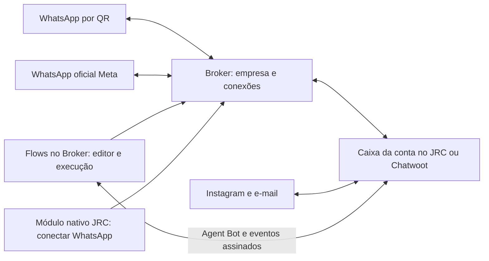

# Broker JRC independente: conexões, Chatwoot e Flows

Candidato local de 18/09/2026, branch `codex/broker-omnichannel-20260918`.
Este guia atualiza o escopo da release de 17/09: o Broker também administra e
executa Flows. JRC Conversas e instalações Chatwoot compatíveis podem ser destinos
das empresas. O Dashboard App continua opcional, desligado por padrão.

## O que cada sistema faz



Há duas formas de executar uma automação. Escolha **uma por canal/caixa**:

| Forma | Onde configurar | Uso |
| --- | --- | --- |
| Canal WhatsApp direto | Broker → JRC Flows → Conexões | Chatbot sem exigir Chatwoot. Usa o canal de mensagens QR ou Meta do Broker. |
| Caixa de atendimento | Broker → JRC Flows → Conexões → Caixas do Chatwoot / JRC | O Broker associa um Agent Bot à caixa. Pode atender WhatsApp, Instagram ou e-mail já configurados nessa instalação. |

Instagram e e-mail não são novos conectores de transporte do Broker: continuam
conectados ao Chatwoot/JRC, que entrega as respostas ao canal. O Broker processa
mensagens de texto recebidas pela integração da caixa.

O módulo **Flows dentro do JRC Conversas** continua disponível e tem seu próprio
motor. Não há sincronização automática de rascunhos, sessões ou versões entre os
dois editores. Para centralizar a automação no Broker, use o segundo caminho da
tabela e desative o fluxo nativo da mesma caixa. O ajuste JRC desta entrega impede
que o motor nativo execute ou entregue respostas enquanto há Agent Bot ativo na
caixa, inclusive para conversas anteriores à associação.

## Configurar pelo painel

### 1. Empresa e WhatsApp

1. Entre na administração `/jrc`, cadastre a empresa e seus usuários, limites e
   canais permitidos. Habilite **Flows** para a empresa que usará automação.
2. No portal da empresa, confirme a organização ativa.
3. Para WhatsApp por dispositivo, abra **Conexões**, crie a conexão e faça o
   pareamento por QR. O motor privado mantém a sessão; as telas usam a marca JRC.
4. Para WhatsApp oficial, use **WhatsApp oficial**. O aplicativo Meta da JRC,
   Embedded Signup, credenciais, webhook e ativos precisam estar configurados.
   O cliente autoriza a conta empresarial e o número. Não use o QR do dispositivo
   como substituto da autorização oficial. Consulte `saas-meta.md`.
5. Em **Mensagens e automações**, confira o canal correspondente à conexão. A
   vinculação do Flow direto usa esse canal de mensagens, não um ID de caixa.

A empresa pode usar seus canais WhatsApp no Broker sem contratar JRC Conversas.
`CHATWOOT_BASE_URL` é opcional no Compose; deixe-o vazio quando o Broker usar
somente destinos Chatwoot externos aprovados para cada empresa.

### 2. Vincular JRC Conversas ou Chatwoot

1. Configure o destino da empresa: **origem HTTPS da instalação**, sem o caminho
   `/app/accounts/...`. Um administrador da plataforma precisa aprovar o destino.
2. Abra **JRC Conversas** em `/integracoes` e informe o ID da conta e o token de
   um administrador dessa conta. O token fica cifrado no backend. A chave de API
   do Broker é outra credencial e não substitui esse token.
3. Para levar um WhatsApp do Broker ao atendimento, selecione a conexão e crie
   ou vincule a caixa API. O painel configura o webhook de retorno da caixa.
4. Para uma caixa Instagram/e-mail que já funciona no Chatwoot, preserve a
   configuração do canal; não a transforme em caixa API. Depois selecione-a no
   Flow. A autorização continua limitada à conta vinculada da empresa.
5. Valide primeiro entrada e resposta manual. Só depois ative o chatbot.

### 3. Criar e ativar o chatbot

1. Abra **JRC Flows** (`/flows`). Crie um flow, escolha um modelo ou importe JSON.
2. Edite os nós e conexões. **Salvar** altera o rascunho; **Publicar versão**
   disponibiliza uma versão imutável para execução. Use o simulador antes.
3. Em **Conexões**, escolha o canal WhatsApp direto **ou** clique em **Caixas do
   Chatwoot / JRC**, selecione a caixa e use **Ativar chatbot nesta caixa**.
4. Na integração por caixa, o Broker cria/associa um Agent Bot. Se já existir
   outro bot, a ativação é bloqueada; não há substituição silenciosa.
5. Uma nova mensagem de texto em conversa **pendente** inicia o flow. Resposta
   humana, atribuição humana ou saída do estado pendente interrompem o bot.
   A ação **Transferir para humano** abre a conversa depois das mensagens do
   flow. Configure essa ação quando o atendimento deve continuar com a equipe.
6. Consulte **Ver execuções nas caixas**. “Entregue à API do Chatwoot” confirma a
   aceitação pelo Chatwoot, não a leitura ou entrega final no WhatsApp/e-mail.
7. Para retirar a automação, use **Desativar chatbot da caixa**. Se a instalação
   estiver indisponível ou o destino tiver mudado, a tela informa a necessidade
   de remover também a associação do Agent Bot no Chatwoot.

Sessões iniciadas conservam a versão publicada que receberam. Publicar uma nova
versão não altera uma conversa em andamento. Uma sessão encerrada ou transferida
não reinicia automaticamente na mesma conversa. Use uma nova conversa para um
novo atendimento. Não há botão de retomada forçada de sessão nesta versão.

### 4. Onde o agente encontra o QR

- **JRC Conversas com módulo nativo:** “Conectar seu WhatsApp” e configurações da
  caixa. O administrador configura a origem do Broker, ID da empresa e chave de
  controle; o agente só reconecta caixas às quais recebeu acesso e delegação.
  Não é necessário abrir uma conversa para escanear o QR.
- **Chatwoot externo sem alteração do código:** o pareamento fica no portal
  Broker. A associação por conta/token/webhook e Agent Bot não adiciona uma aba
  nativa de QR ao Chatwoot. O Dashboard App opcional fica dentro da conversa e
  continua sendo uma alternativa beta; não é requisito para o chatbot.

## Compatibilidade e limites do Flow no Broker

- Nós executados: início, mensagem de texto, entrada/resposta, condição,
  variável, transferência humana e fim.
- JSON JRC/Broker e subconjunto n8n suportado pelo importador. Nós sem executor
  aparecem como incompatíveis e impedem publicação. Não há compatibilidade
  integral com n8n ou Typebot; JavaScript, HTTP arbitrário, voz, interpretação de
  anexos e agente de IA não são executados pelo novo motor do Broker.
- Até 150 nós, 300 conexões, limite de passos por turno/sessão e validação de
  estrutura/ciclos. O simulador não envia mensagens reais.
- A instalação Chatwoot precisa oferecer API de conta, Agent Bots com token e
  segredo de assinatura, associação à caixa e eventos assinados. Sem essa
  capacidade, o vínculo não é ativado. Uma instalação compatível não precisa
  instalar um módulo JRC para usar o chatbot por caixa.
- Dados de empresas são isolados no PostgreSQL por RLS. Eventos são deduplicados
  por vínculo/mensagem; estado e respostas ficam persistidos. Mudanças de conta,
  destino, credencial, suspensão ou desativação invalidam o processamento antigo.
- Consultas transitórias são tentadas até cinco vezes, com intervalo de 30s,
  sem bloquear outras conversas da empresa. A conversa com falha conserva a
  ordem dos eventos; depois do limite precisa de investigação/atendimento humano.
- Envio com resultado incerto fica **UNKNOWN**, sem reenvio automático. As
  respostas seguintes da mesma conversa aguardam a resolução. Esta entrega
  permite consultar o erro, mas não inclui uma interface de reprocessamento
  manual da fila de Flows. Não prometa entrega exatamente uma vez entre sistemas.
- O Compose em um servidor não oferece HA de banco ou da sessão WhatsApp.

## Preparar a atualização no Dokploy

Esta tarefa gerou imagens **locais**; não fez push, merge, publicação em GHCR ou
deploy. O workflow `images.yml` continua manual e agora também executa a suíte
de integração com PostgreSQL/Redis descartáveis antes de construir as imagens.

1. Revise a branch candidata e os resultados em
   `../validation/2026-09-18-broker-omnichannel.md`. Quando a publicação for
   autorizada, envie a revisão e execute **Build reviewed SaaS images**.
   `publish=false` constrói; `publish=true` publica a revisão completa em GHCR.
2. Registre os digests resultantes e atualize `JRC_API_IMAGE` e `JRC_WEB_IMAGE`.
   **API e worker usam a mesma imagem API.** Não use o ID local do Docker como
   se fosse um digest já publicado no registro.
3. Preserve stack, bancos, volumes, domínio e chaves. Faça backup verificável.
   A tela do servidor informada pelo operador tem Autodeploy habilitado: antes
   de enviar mudanças à branch monitorada, controle esse gatilho de implantação.
4. Em janela de manutenção, pare os consumidores e aplique o serviço `migrate`
   do Compose. Ele executa `infra/app/provision.mjs`, incluindo as migrações
   `0024_flows.sql` e `0025_flow_chatwoot.sql`. Não basta trocar só o frontend.
5. Reinicie API/worker/web na mesma revisão. Confira `/health`, `/ready`, saúde
   do worker e acesso de duas empresas isoladas. Faça o piloto abaixo antes
   de habilitar o recurso para todas as empresas.

Variáveis da stack Broker:

```dotenv
CHATWOOT_EXTERNAL_DESTINATIONS_ENABLED=true
CHATWOOT_CONTROL_ENABLED=true
CHATWOOT_EMBED_ENABLED=false
```

`EXTERNAL_DESTINATIONS` permite destinos por empresa; ainda exige aprovação de
cada origem. `CONTROL` habilita o módulo nativo QR do JRC. Preserve
`INTEGRATION_ENCRYPTION_KEY`, chaves Meta, autenticação e demais segredos existentes.
Não há segredo novo de bot para colar no frontend: a associação o obtém e cifra.
Habilite **Flows por empresa** na administração do Broker.

No JRC, use a branch `codex/jrc-omnichannel-20260918` e o complemento documentado
em `docs/DEPLOY-BROKER-OMNICHANNEL.md` desse repositório. Rails e Sidekiq precisam
da mesma revisão para respeitar a prioridade do Agent Bot. O módulo QR nativo e
os Flows nativos mantêm as respectivas flags globais e por conta.

### Piloto ainda necessário no ambiente de homologação

Validar um WhatsApp QR autorizado, um número de teste Meta e uma caixa
Instagram/e-mail configurada: entrada, resposta manual, resposta automática,
transferência humana, interrupção, reconexão e retomada após reinício. Conferir
assinaturas com a versão real do Chatwoot alvo. Os testes automatizados desta
tarefa usam provedores e eventos sintéticos, sem números/credenciais de produção.

### Retorno às referências anteriores informadas pelo operador

```dotenv
JRC_API_IMAGE=ghcr.io/claudiohideki/brokerjrcia-api@sha256:99d648ebc38509a53a072275ae40cd9ecc95b1ef893ab421f861e830ef30b0a3
JRC_WEB_IMAGE=ghcr.io/claudiohideki/brokerjrcia-web@sha256:ecec6331978924295476d9193db0e7cda27b64a96a0104daa316ed73bd877bed
```

JRC informado: `ghcr.io/claudiohideki/jrc-conversas-nico-v12-2-7-comercial-integrado:sha-f38fe02`.
Essas referências foram fornecidas pelo operador; não se inspecionou o servidor
para confirmar que continuam implantadas. Antes do rollback, desative os Flows,
retire seus Agent Bots das caixas e pare os consumidores. Preserve tabelas e
chaves; não apague volumes nem reverta migrações destrutivamente. Reconcilie
entregas incertas antes de reativar a operação.
