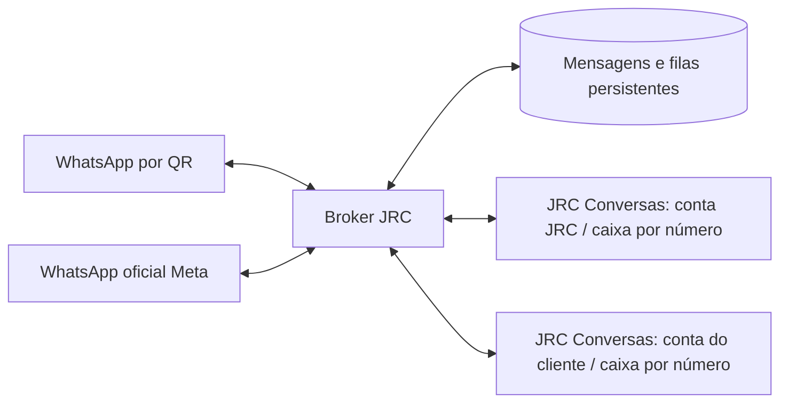

# Broker JRC e JRC Conversas

## Modelo de operação

O administrador global gerencia as empresas. A JRC deve ter sua própria organização, vinculada à **conta 1** da instalação `https://jrcconversas-lab.jrcws.cloud`. Cada cliente comercial recebe outra organização e outra conta. Uma conta dessa instalação não pode pertencer a duas organizações do broker.

Cada WhatsApp usa uma caixa API do JRC Conversas. O fluxo é:



A integração passa a receber eventos novos após sua ativação. Ela não importa automaticamente históricos ou transfere sessões já existentes em outro servidor.

## Configuração inicial da instalação

1. Configure `PUBLIC_ORIGIN` com o domínio HTTPS do broker e `CHATWOOT_BASE_URL` com a origem do JRC Conversas, sem `/app/accounts/...`.
2. Gere `INTEGRATION_ENCRYPTION_KEY` com 32 bytes aleatórios em base64 e `QR_WEBHOOK_SIGNING_KEY` com ao menos 32 caracteres aleatórios. Guarde cópia em cofre. Trocar a chave de integração sem recifrar os dados torna tokens e anexos antigos ilegíveis.
3. O Compose define `QR_WEBHOOK_ORIGIN=http://api:3000` para o motor na rede privada. A URL externa da caixa usa `PUBLIC_ORIGIN`. Em desenvolvimento, o container do motor precisa alcançar a porta local da API; uma URL loopback do host não é automaticamente loopback do container.
4. Para criação automática de contas, configure `CHATWOOT_PLATFORM_TOKEN`, emitido pela instalação Chatwoot para uma Platform App. O token comum do perfil serve para vincular uma conta existente, mas não substitui esse token de plataforma.
5. Configure separadamente o aplicativo JRC da Meta conforme [guia Meta](saas-meta.md). Credenciais ausentes deixam o canal oficial pendente, sem simular conexão.

## Primeira empresa e clientes seguintes

No painel `/jrc`, abra a empresa e a aba **JRC Conversas**:

- **JRC:** vincule a conta `1` usando um token de perfil com permissão de administrador nessa conta.
- **Cliente com conta existente:** informe o ID e um token autorizado para a conta dele.
- **Cliente novo:** com o token de plataforma configurado, use o formulário de criação de conta/responsável. A sequência persistida cria conta, usuário, acesso e verifica o vínculo. Se o e-mail já existir no Chatwoot, sua senha existente é preservada.
- Escolha a conexão WhatsApp e crie uma caixa API, ou selecione uma caixa API existente. O broker configura e mostra o webhook. Uma caixa com webhook anterior exige confirmação explícita da substituição.
- Selecione os atendentes já cadastrados naquela conta. O broker recusa IDs de usuários que não pertencem à conta.

Caixas WhatsApp oficiais nativas do Chatwoot não são caixas API. Para que o broker seja o responsável pelo envio, o número deve estar autorizado no broker e ligado a uma caixa API. Planeje essa transição antes de substituir integrações em uso.

O portal `/integracoes` permite ao administrador da empresa fazer os vínculos da própria organização. A chave emitida em `/chaves-api` é uma credencial da API JRC com os escopos exibidos; não é o token Meta nem o token de perfil do JRC Conversas. Seu valor completo aparece somente na emissão. O conector usa a credencial dedicada configurada na integração.

## Entregas e falhas

- Webhooks são autenticados e confirmados após persistência. Eventos repetidos usam identificação para evitar novas mensagens.
- Mensagens privadas do atendente e ecos da própria integração não são enviados ao WhatsApp.
- Entrada e resposta de texto, imagens, áudio, vídeo, documentos e stickers têm tratamento próprio, sujeito ao formato e limite do canal.
- Falhas repetíveis usam atraso progressivo e limite de tentativas. A tela mostra pendências, falhas e IDs para investigação.
- **Conferência necessária:** a requisição pode ter sido executada no destino. Use a conciliação pelo registro remoto; não faça reenvio manual às cegas.
- Uma caixa pausada conserva novas tarefas. Retomar a caixa permite processá-las novamente.
- Na Meta, texto livre depende da janela de atendimento. Fora dela, use template aprovado no painel de mensagens ou aguarde resposta do contato. O campo comum de texto do Chatwoot não cria templates Meta.

## Backup cifrado e restauração

O utilitário roda no host que possui Node e Docker CLI. Defina `JRC_BACKUP_KEY` no ambiente com uma chave independente de 32 bytes aleatórios em base64. Não coloque a chave no diretório do backup.

```text
node scripts/operations/backup.mjs backup infra/dokploy/compose.yaml runtime.env /backup/jrc/AAAA-MM-DD
node scripts/operations/backup.mjs verify /backup/jrc/AAAA-MM-DD
node scripts/operations/backup.mjs decrypt /backup/jrc/AAAA-MM-DD/broker.dump.jrcbak /restore/broker.dump
```

O diretório de destino e o arquivo de saída devem ser novos. A verificação confere hashes e autenticação da cifra. O conjunto inclui dois dumps PostgreSQL, roles, arquivos de sessão do motor e ambiente cifrado. Inclua também snapshot consistente do volume Redis, versões/digests e cópia externa dos backups. Não há rotina de agendamento instalada por esse comando.

Cada dump tem consistência transacional própria. Os dois bancos e arquivos do motor não são um snapshot atômico da stack. Para uma cópia coordenada, faça janela de manutenção: pare entrada de novos eventos e workers, aguarde envios em curso, coloque o motor sem novas gravações, copie os dados e só então retome. Use snapshots da infraestrutura quando não for possível manter os arquivos estáveis. Não declare RPO/RTO sem medir esse procedimento no servidor alvo.

Para restaurar:

1. Use outra stack isolada, com API, workers e motor parados. Verifique e decifre a cópia em diretório privado.
2. Restaure roles em PostgreSQL novo; crie os bancos com os proprietários corretos e use `pg_restore --exit-on-error` para cada dump. Não importe globals sobre o banco compartilhado de produção.
3. Restaure o volume de sessões do motor e o snapshot Redis da mesma janela; preserve todas as chaves do ambiente. Dados do backup contêm credenciais e precisam continuar privados.
4. Use a mesma revisão de aplicação/schema; depois aplique migrations necessárias em manutenção. Verifique `/ready`, acesso administrativo, duas empresas isoladas e leitura de anexos.
5. Antes de retomar, concilie mensagens que estavam enviando ou cujo resultado é desconhecido. Um backup antigo pode conter pendências que já foram entregues após sua captura.
6. Remova os temporários decifrados e mantenha a evidência da restauração. Sessões externas podem exigir novo QR ou autorização.

## Homologação antes de clientes reais

- Domínio HTTPS alcançável pelo Chatwoot e pela Meta; callbacks assinados aceitos na versão instalada.
- JRC/conta 1 vinculada, caixa piloto e atendente autorizados; duas organizações de teste sem acesso cruzado.
- Um QR e um número Meta autorizados; texto e anexos nos dois sentidos; estados de envio; retomada após reinício e falha temporária.
- Requisitos externos Meta: aplicativo configurado, permissões/revisão/verificação aplicáveis, número e cobrança habilitados.
- Backup fora do servidor e restauração medida; monitoramento de indisponibilidade, disco, fila e falhas configurado na operação.

O Compose atual é para um servidor. Cluster/HA, failover de sessões QR, agendamento de mensagens, exclusão por retenção e alertas externos por SLA não são declarados concluídos por esta entrega. A fila durável resolve transporte e recuperação básica; não substitui esses projetos de operação.
