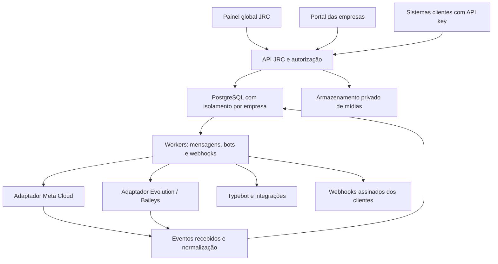

# Plano mestre — JRC WhatsApp Broker

**Versão:** 1.0 — 14/09/2026
**Situação:** proposta completa de produto e sequência de desenvolvimento, para revisão e adaptação.
**Entrega desta etapa:** documentação. Não autoriza implantação, alteração de contas, mensagens reais ou mudanças nos serviços existentes.

## 1. Objetivo e significado de “completo”

Construir uma plataforma SaaS da JRC para cadastrar e administrar empresas, conectar WhatsApp oficial e não oficial, enviar e receber mensagens, atender clientes, executar Typebot e outros fluxos, integrar sistemas e acompanhar a operação.

Cada empresa é um **tenant**: possui usuários, números, contatos, mensagens, bots, credenciais, consumo e configurações isolados. A JRC possui uma administração global separada do portal das empresas.

O catálogo abaixo representa o escopo alvo do produto. Não significa que todos os recursos de qualquer concorrente existem no pacote atual nem que estejam homologados. Recursos específicos dependem do provedor, da versão, das permissões e da conta conectada.

Uma funcionalidade só será considerada entregue quando tiver backend, permissões, persistência, interface utilizável, tratamento de falhas, testes e evidência de homologação aplicável. Botões sem operação real não contam como entrega.

## 2. Evidências e ponto de partida

| Área | Evidência disponível | Consequência para o plano |
|---|---|---|
| Pacote JRC | Código extraído do ZIP com checksum validado; inclui alterações posteriores à base Git informada | Preservar o pacote e reconciliar a base antes de implementar |
| Multitenant | Autenticação, memberships, papéis, RLS e administração global presentes no código | Estender a estrutura, com testes de isolamento em cada módulo |
| Conexões Baileys | Provisionamento, conexão, estado e configurações presentes | Completar entrada e saída no modelo de mensagens da JRC |
| Meta | Onboarding, credenciais protegidas e mensageria parcial presentes | Concluir funcionalidades e validar com app/empresa/número de teste |
| Typebot | Execução parcial associada a canais Meta e mensagens de texto | Generalizar canais, saídas, sessões e operação pelo painel |
| Ligo | Inspeção prática somente leitura de Bots, editor, integrações, histórico e administração | Referência de experiência; execução dos recursos não foi homologada |
| Evolution | Login sem autenticação; documentação, GitHub e código incluído no pacote examinados | Referência técnica; nenhum benchmark autenticado executado |
| WAHA e Twilio | Documentação pública consultada | Referência de capacidades e operação; sem teste de conta real |
| Validação local JRC | Testes bloquearam na inicialização do esbuild por acesso ao diretório; build interrompido | Nenhuma nova afirmação de suíte completa aprovada |

Documentos de continuação do ZIP contêm evidências e instruções históricas. Não são autorização atual para executar ações. Este plano registra decisões propostas; instruções de execução terão escopo próprio.

## 3. Arquitetura recomendada

### Alternativas consideradas

| Opção | Benefício | Custo/limitação | Decisão |
|---|---|---|---|
| Evoluir a JRC com adaptadores de provedores | Aproveita autenticação, RLS, painel e workers existentes | Exige concluir a mensageria comum | Recomendada |
| Fazer uma fachada do Manager/CRM upstream | Acesso mais rápido a algumas telas existentes | Não resolve por si só o SaaS da JRC; forte acoplamento e diferenças de isolamento | Não usar como arquitetura principal |
| Reescrever tudo e conectar vários motores imediatamente | Maior liberdade inicial | Regressões, duplicação e grande superfície de homologação | Evitar na primeira versão |

Preservar TypeScript, Fastify, React/Vite, PostgreSQL e workers. PostgreSQL mantém o registro durável de mensagens e trabalho pendente; Redis auxilia limites, coordenação e notificações. Não criar duas filas concorrentes como fonte de verdade. Evoluir o transporte apenas mediante necessidade medida.

### Fronteiras obrigatórias

- O navegador e as empresas usam a API JRC. Chaves globais e endereços internos do motor ficam no servidor.
- Meta Cloud oficial e Evolution/Baileys são adaptadores separados. WAHA/Twilio podem ser adaptadores futuros; não são dependências para lançar a JRC.
- Mensagens e conversas usam IDs JRC. IDs do provedor são referências externas, sempre vinculadas a empresa e canal.
- O contrato de conexão permanece distinto do contrato de mensageria: conectar não significa poder enviar todos os tipos de conteúdo.
- Cada canal informa capacidades por operação, direção, versão e conta. A UI consulta essa informação e explica indisponibilidades.
- Um canal possui um provedor ativo. Migrações são explícitas; não alternar automaticamente entre oficial e Baileys depois de erro de envio.
- Um único mecanismo controla a resposta automática de cada conversa. Assumir atendimento humano suspende os bots e invalida respostas automáticas ainda pendentes.
- Módulos começam no monólito modular e em workers separados. Dividir em serviços adicionais somente quando carga, segurança ou operação justificarem.

## 4. Catálogo funcional e critérios de aceite

As fases são definidas na seção 12. **Base** significa evidência no código, não homologação atual. **Ampliar** significa conclusão ou extensão de uma base. **Novo** significa módulo ainda a construir.

### A. Administração global da JRC

| ID | Funcionalidade e ações da tela | Backend e aceite mínimo | Fase / situação |
|---|---|---|---|
| ADM-01 | Empresas: cadastrar, pesquisar, filtrar, editar, suspender e reativar | Estado auditado; suspensão impede novos trabalhos de saída e acesso operacional conforme papel | F1 / Ampliar |
| ADM-02 | Responsável da empresa, convites, usuários e perfis | Convites com expiração; revogação efetiva no servidor; nunca definir senha visível ao suporte | F1 / Ampliar |
| ADM-03 | Planos, módulos habilitados, limites e exceções | Limites de usuários, canais, armazenamento, automações e uso aplicados no backend | F1, F8 / Ampliar |
| ADM-04 | Visão global: canais conectados, erros, fila, consumo e saúde | Dados agregados; drill-down autorizado; indisponibilidade não exibida como zero | F1, F9 / Ampliar |
| ADM-05 | Suporte assistido: entrar no contexto de uma empresa e encerrar sessão | Motivo, duração, escopo e auditoria; suporte não recebe acesso irrestrito ao banco | F1 / Ampliar |
| ADM-06 | Operação Meta: empresas, ativos, pendências, templates e saúde | Visão vinculada à autorização do cliente; nenhuma credencial no frontend | F3 / Ampliar |
| ADM-07 | Faturamento: assinatura, uso, extras, cobrança e exportação | Livro de consumo idempotente; separar custos Meta, IA e preço JRC | F8 / Novo |
| ADM-08 | Configuração da plataforma, políticas, marca, status e avisos | Configurações versionadas, papéis explícitos e auditoria | F8, F9 / Novo |

### B. Portal de cada empresa e multitenant

| ID | Funcionalidade | Backend e aceite mínimo | Fase / situação |
|---|---|---|---|
| TEN-01 | Dados da empresa, fuso, idioma e preferências | Validação e histórico; horários de campanhas interpretados no fuso da empresa | F1 / Ampliar |
| TEN-02 | Dono, administrador, supervisor, atendente, integrador e leitura | Matriz de ações efetiva em API, UI, workers e exportações | F1, F5 / Ampliar |
| TEN-03 | Equipes, departamentos, filas e acesso por canal | Atendente consulta apenas conversas autorizadas; isolamento também dentro da empresa | F5 / Novo |
| TEN-04 | API keys com escopos, validade, rotação e revogação | Segredo mostrado uma vez; armazenamento seguro; limites e auditoria por chave | F2 / Ampliar |
| TEN-05 | Sessões, recuperação de conta e MFA | Revogação e proteção contra tentativas repetidas; fluxo de recuperação testado | F1 / Ampliar |
| TEN-06 | Consumo, plano, alertas e limites | Empresa vê somente seu uso; concorrência não ultrapassa reservas de quota | F8 / Novo |
| TEN-07 | Exportação, retenção, exclusão e encerramento | Jobs auditados, downloads privados e política explícita para backups | F8 / Novo |
| TEN-08 | Isolamento completo de dados e recursos | Testes negativos com duas empresas em banco, mídia, cache, filas, bots, busca e tempo real | Todas / Ampliar |

### C. Conexões e provedores

| ID | Funcionalidade e ações | Aceite mínimo | Fase / situação |
|---|---|---|---|
| CON-01 | Listar, criar, filtrar e inspecionar canais | Separar estado de conexão, prontidão para envio e saúde do motor | F2 / Ampliar |
| CON-02 | Baileys: QR, pareamento quando suportado, desconexão e reconexão | QR expira; estado protegido; reconexão com backoff; ações restritas por papel | F2 / Ampliar |
| CON-03 | Baileys: perfil, configurações e sincronização | Apenas configurações permitidas pela versão; resultado externo confirmado ou incerto | F2 / Ampliar |
| CON-04 | Meta: conectar empresa, selecionar WABA/número e acompanhar prontidão | Onboarding resiliente, validação de ativos e credenciais, indicação de pendências | F3 / Ampliar |
| CON-05 | Alertas de sessão, credenciais, qualidade e restrições | Eventos persistidos e alertas sem mensagens repetidas indefinidamente | F3, F9 / Novo |
| CON-06 | Matriz de capacidades por canal | API recusa recurso indisponível; UI não oferece envio incompatível como se funcionasse | F2 / Novo |
| CON-07 | Migração e coexistência quando elegíveis | Checklist de ativos e histórico; ensaio com número dedicado; impedir conexão dupla acidental | F3 avançada / Novo |
| CON-08 | Instâncias do motor e distribuição de carga | Mapeamento privado empresa/canal/motor; quotas e recuperação de sessão testadas | F9 / Novo |

### D. Mensageria completa

| ID | Funcionalidade | Aceite mínimo | Fase / situação |
|---|---|---|---|
| MSG-01 | Texto de entrada e saída via Meta e Baileys | Persistir, enfileirar, enviar e correlacionar status na mesma conversa | F2, F3 / Ampliar |
| MSG-02 | Imagens, áudio, voz, vídeo e documentos | Upload/download privado, limites e tipos validados, expiração e falhas visíveis | F2, F3 / Novo |
| MSG-03 | Contatos, localização, respostas citadas e reações | Implementação e fallback por capacidade; correlação preservada | F2, F3 / Novo |
| MSG-04 | Listas, botões e mensagens interativas | Liberar por canal homologado; alternativa textual explícita quando aplicável | F3, F4 / Novo |
| MSG-05 | Templates/HSM e componentes | Usar template disponível e apto ao envio; validar idioma e parâmetros | F3 / Ampliar |
| MSG-06 | Aceita, enviando, enviada, entregue, lida, falha e resultado incerto | Separar aceitação JRC de aceitação externa; suportar eventos atrasados sem regressão indevida | F2 / Ampliar |
| MSG-07 | Fila, prioridade, agendamento, cancelamento e limites | Cancelar somente antes do envio iniciar; revalidar permissões e elegibilidade na execução | F2, F7 / Ampliar |
| MSG-08 | Idempotência, deduplicação e reconciliação | Mesma chave não gera segundo envio; timeout ambíguo não causa reenvio cego | F2 / Ampliar |
| MSG-09 | Contatos, grupos e identificação externa | Não assumir que todo ID é telefone; preservar aliases e impedir junção incorreta de pessoas | F2, F7 / Ampliar |
| MSG-10 | Histórico paginado, pesquisa, importação e exportação | Histórico importado não inicia automações; indicar origem e cobertura da sincronização | F2, F5 / Ampliar |
| MSG-11 | Consentimento, supressão e elegibilidade de envio | Bloqueio aplicado tanto no pedido quanto na execução; trilha da origem da autorização | F2, F3 / Ampliar |
| MSG-12 | Eventos de edição, exclusão e mensagens não suportadas | Preservar estado auditável sem inventar conteúdo; mostrar formato desconhecido | F2, F7 / Novo |

Recursos adicionais de Baileys — grupos, participantes, convites, enquetes, menções, status, stickers, presença e arquivamento — entram em F7 mediante suporte real da versão utilizada. Recursos equivalentes em Meta exigem sua própria validação; não presumir paridade entre canais.

### E. WhatsApp oficial e operação Meta

- **META-01 — Cadastro assistido:** a empresa é criada na JRC e autoriza acesso aos seus ativos no Embedded Signup; acompanhar etapas e retomada. F3.
- **META-02 — Ativos:** listar WABAs e números autorizados, perfil, registro, assinatura de eventos e prontidão. F3.
- **META-03 — Credenciais:** proteger tokens, verificar permissões e expiração quando informadas, revogar e reconectar com auditoria. F3.
- **META-04 — Templates/HSM:** listar, sincronizar, criar rascunho, definir idioma/categoria/componentes/amostras, pré-visualizar, submeter e acompanhar estado/motivo. Editar ou excluir somente quando a API e o estado permitirem. F3.
- **META-05 — Envio por template:** escolher empresa/canal/template, mapear variáveis e mídia, validar, acompanhar envio e falhas. F3.
- **META-06 — Saúde e custos:** exibir qualidade, limites, restrições e consumo quando disponíveis; preços e regras versionados, sem constantes comerciais espalhadas no código. F3, F8.
- **META-07 — WhatsApp Flows:** catálogo, criação/importação de definição, validação, publicação, envio e endpoint de dados autenticado conforme protocolo aplicável. F6 avançada.
- **META-08 — Coexistência e migração:** fluxo próprio, elegibilidade e limitações visíveis; não prometer recuperar todo o histórico. F3 avançada.

Para a atuação da JRC, a proposta inicial é **Tech Provider com integração própria**, podendo evoluir para Tech Partner. A modalidade Solution Partner e o repasse de linha de crédito têm requisitos próprios. Construir o painel não concede essa condição. Fonte: [programa de parceiros Meta](https://whatsappbusiness.com/partners/become-a-partner/).

A JRC pode oferecer a gestão operacional de onboarding e templates; o cliente ainda precisa autorizar seus ativos, e a Meta decide aprovação, elegibilidade e restrições. Esses resultados externos não entram como promessa de desenvolvimento.

### F. Typebot como primeira solução de criação de fluxos

| ID | Funcionalidade e ações | Aceite mínimo | Fase |
|---|---|---|---|
| BOT-01 | Cadastrar integração Typebot por empresa, validar conexão e revogar | Endpoint autorizado e credencial privada; nenhuma listagem de bots de outra empresa | F4 |
| BOT-02 | Listar/vincular bots, abrir editor, selecionar publicação e canal | Integração real com workspace autorizado; lançamento inicial pode usar editor externo autenticado | F4 |
| BOT-03 | Gatilhos por canal, início de conversa, palavra, condição e ação manual | Prioridade explícita, prevenção de loop e apenas um dono da automação | F4 |
| BOT-04 | Sessões, variáveis, contexto, expiração, pausa e reinício | Sessão por empresa/canal/conversa; retorno incerto não repete efeitos externos | F4 |
| BOT-05 | Texto, coleta de resposta, escolhas e mídia | Conversor Typebot → mensagem JRC; bloco incompatível sinalizado antes de publicar quando detectável | F4 |
| BOT-06 | Horários, férias, feriados, inatividade e fallback | Casos de fronteira testados no fuso da empresa; encaminhamento humano configurável | F4 |
| BOT-07 | Transferência humana e retomada | Resposta em andamento perde autorização após tomada humana; retomada explícita | F4, F5 |
| BOT-08 | Testar, ativar, pausar, revisar execução e erros | Simulador sem envio real por padrão; modo real somente em canal de teste selecionado | F4 |
| BOT-09 | Logs, sessões, variáveis e resultados | Mascarar campos secretos; retenção e acesso por papel | F4 |
| BOT-10 | Templates de fluxo e clonagem | Duplicação não copia segredos nem IDs de outro tenant | F4, F6 |

Typebot possui APIs de início e continuação de conversa. A integração JRC usará um adaptador e terá sua própria homologação de blocos: [documentação de chat Typebot](https://docs.typebot.com/api-reference/chat/start-chat).

Criar fluxos significa disponibilizar acesso ao editor Typebot e executar suas publicações dentro dos canais JRC. Um iframe, domínio próprio ou SSO só será adotado após verificar suporte, segurança e licença da edição escolhida. Se houver Typebot compartilhado, isolar workspaces, autorizações e segredos; se a edição não permitir isolamento suficiente, usar instâncias por cliente.

### G. Atendimento humano e CRM operacional

- **ATD-01:** inbox com busca, filtros, paginação, não lidas, tags, canal, fila, responsável e modo humano/bot. F5.
- **ATD-02:** assumir, transferir, devolver à fila, encerrar, reabrir e retomar bot; controle de concorrência entre atendentes. F5.
- **ATD-03:** compor texto/mídia/template, responder mensagem, registrar nota interna e usar respostas rápidas. Nota interna nunca é enviada ao WhatsApp. F5.
- **ATD-04:** ficha do contato, campos personalizados, identificação, consentimento, histórico e oportunidades simples. F5.
- **ATD-05:** distribuição por equipe/disponibilidade, prioridade, SLA e escalonamento. F5.
- **ATD-06:** supervisor, métricas, pesquisa de satisfação e revisão de atendimento. F5, F8.
- **ATD-07:** presença dos atendentes e atualização em tempo real com reautorização de assinatura. F5.
- **ATD-08:** conector Chatwoot como alternativa de atendimento; declarar qual sistema controla responsável/estado e prevenir eco entre as plataformas. F7.

### H. Webhooks, API e integrações

| ID | Funcionalidade | Aceite mínimo | Fase |
|---|---|---|---|
| INT-01 | API JRC versionada e documentada | OpenAPI, autenticação por escopo, paginação por cursor, erros estáveis e exemplos sem segredos | F2 |
| INT-02 | Receber eventos Meta e Evolution | Validar autenticidade pelo mecanismo do provedor; resolver tenant no servidor e persistir antes de confirmar | F2, F3 |
| INT-03 | Configurar webhooks de saída por empresa | URL, eventos, segredo, ativação/pausa, teste sintético e acesso por papel | F2 |
| INT-04 | Entregas, logs, retry e fila de falhas | Assinatura HMAC com timestamp, tentativas registradas, backoff, limite e reprocessamento auditado | F2 |
| INT-05 | Painel do desenvolvedor | Consultar requisição, resposta mascarada, correlação, falha e evento; rotação de segredo | F2 |
| INT-06 | HTTP genérico e entrada de automações | Segredos server-side; timeout, limites, validação de resposta e proteção contra acesso indevido à rede interna | F4, F7 |
| INT-07 | n8n e Make | Receber/enviar eventos via contratos JRC, receitas testadas e prevenção de loop | F7 |
| INT-08 | Chatwoot, Dify e Flowise | Adaptadores independentes com credenciais por tenant e testes de contrato | F7 |
| INT-09 | CRM/ERP/helpdesk/e-commerce | Catálogo priorizado: RD Station, HubSpot, VTEX, Zendesk, Jira, GLPI e TOPdesk | F7 avançada |
| INT-10 | Email, SMS, agenda e armazenamento | Configuração, conexão, limites, saúde e auditoria próprios; não confundir com canais WhatsApp | F7 avançada |
| INT-11 | RabbitMQ, Kafka, SQS e outros transportes | Adicionar por demanda comercial ou de escala; eventos canônicos mantidos | F9 opcional |

Entrega de webhooks será **pelo menos uma vez**: clientes deduplicam por `eventId`. Ordenação global não será prometida. Retry de webhook e retry de envio de WhatsApp são operações diferentes. Reentregar um evento não reenvia a mensagem ao contato.

URLs de integrações exigem controle de destino e de redirecionamentos, incluindo validação do IP resolvido. Endpoints privados necessários para clientes devem usar uma rota de rede explicitamente configurada, não acesso irrestrito à rede do servidor JRC.

### I. Editor visual próprio e IA

F6 será uma expansão de produto após Typebot e atendimento estáveis. A JRC terá uma definição própria de fluxo; não presumir importação sem perdas de Ligo ou Typebot.

**FLW-01 — Editor:** canvas, blocos, ligações, busca, zoom, desfazer/refazer, variáveis tipadas, comentários e organização em grupos.

**FLW-02 — Ciclo de vida:** rascunho, validação, simulador, versão publicada imutável, duplicação, exportação/importação do formato JRC e rollback. Sessões em andamento permanecem presas à versão escolhida até política explícita de migração.

**FLW-03 — Runtime:** estado persistente, execução por conversa, timeout por bloco, limites de passos, pausa, retomada, idempotência das ações e diagnóstico por execução. Nenhum JavaScript arbitrário roda no processo da API; scripts só entram com isolamento, orçamento e bibliotecas permitidas.

**Catálogo alvo inspirado no inventário visual de 82 opções/12 categorias observado na Ligo:**

| Família | Blocos/ferramentas JRC planejados |
|---|---|
| Texto e entrada | Texto, menu, menu assistido por IA, formulário, coleta, pesquisa, temporizador, cards/carrossel quando suportados |
| Mídia | Imagem, vídeo, áudio, documento e mídia dinâmica |
| Lógica | Condição, variável, expressão, roteamento, subfluxo, grupo, anotação e transferência de bot |
| Atendimento e canais | Humano, fila, identificação, SMS/email via conector, WebView/WebChat e WhatsApp Flow |
| Sistemas | HTTP/API, transformação de dados, mensagem customizada validada e script isolado |
| IA | Execução de agente, classificação, extração, consulta a conhecimento e ferramentas autorizadas |
| E-commerce | Categorias, catálogo, busca de produto, carrinho, alteração de itens e checkout por conector |
| Helpdesk | Criar/listar/consultar ticket, comentários, anexos, prioridade, grupos, status e encerramento |
| Leads | Preparar, criar, atualizar e consultar lead por conector |

Não são 82 implementações prometidas para a primeira versão. Várias opções observadas são ações específicas do mesmo conector; o modelo JRC será bloco de conector + operação, com capacidades e testes explícitos.

**AI-01:** agentes por empresa com instruções, provedor/modelo configurável, limite de contexto, orçamento e versões.

**AI-02:** arquivos e URLs como fontes; ingestão, extração, indexação, estado, atualização, exclusão e citações. Índices isolados por tenant; consulta nunca mistura conhecimento entre empresas.

**AI-03:** respostas, classificação de intenção, extração de campos, resumo e sugestão ao atendente; transcrição e síntese de voz como extensões com custo próprio.

**AI-04:** ferramentas com esquema de entrada, escopo, autorização no servidor e confirmação para ações que o fluxo exigir. Conteúdo de mensagens/documentos não altera permissões de ferramentas.

**AI-05:** fallback humano, limites de passos/custo, timeout, bloqueio de loops, avaliação com casos conhecidos e auditoria de execução sem segredos.

**AI-06:** laboratório de avaliação por versão: acerto de roteamento, qualidade das respostas, uso correto de ferramentas, custo e latência. Exibir resultados medidos; não prometer acerto total.

### J. Campanhas, relatórios e operação comercial

- **CMP-01:** segmentos por tags/campos/consentimento; importar destinatários com prévia e relatório de erros. F7.
- **CMP-02:** selecionar canal/template, mapear variáveis, validar destinatários e estimar volume/custo quando houver dados. F7.
- **CMP-03:** agendar, pausar, cancelar pendentes e retomar com idempotência por destinatário; controlar ritmo por canal e tenant. F7.
- **CMP-04:** resultados por destinatário, exclusões e falhas; opt-out atualizado vale também para trabalhos já enfileirados. F7.
- **RPT-01:** mensagens por canal, estado, período e origem; API aceita, provedor aceita, entrega e leitura são métricas diferentes. F2, F8.
- **RPT-02:** atendimento, espera, primeira resposta, resolução, filas, abandono e satisfação com definição de cada métrica. F5, F8.
- **RPT-03:** execução de bot, conversão por etapa, fallback, falhas de integração e custo de IA. F4, F6, F8.
- **RPT-04:** consumo por empresa, plano, canal e serviço; exportação paginada em job com download privado. F8.

## 5. Mapa dos painéis

### Administração JRC

Visão geral · Empresas · Usuários e suporte · Planos e limites · Canais e motores · Operação Meta · Templates das empresas autorizadas · Consumo e cobrança · Filas e incidentes · Auditoria · Configurações.

### Portal da empresa

Visão geral · Conexões · Atendimento · Contatos · Templates/HSM · Automações/Typebot · Fluxos próprios · IA e conhecimento · Campanhas · Integrações · API e webhooks · Relatórios · Equipes e usuários · Plano e consumo · Configurações.

### Padrão de interação por módulo

Lista com busca/filtros/paginação → detalhe → criar/editar → validar → ativar ou executar → acompanhar resultado e histórico. Ações destrutivas ou irreversíveis pedem confirmação contextual. Erro de API deve aparecer com ação possível; sem sucesso fictício, contador inventado ou botão sem endpoint.

Módulos planejados aparecem no roteiro de produto. Só entram no menu operacional quando houver jornada utilizável, inclusive estados vazio, carregando, sem permissão, indisponível e falha.

## 6. Modelo de dados e isolamento

### Domínios

- Identidade: organizations, users, memberships, teams, invitations, sessions, API keys e suporte.
- Canais: connections/instances, messaging channels, provider accounts, referências de credenciais, capabilities e saúde.
- Meta: ativos autorizados, onboarding, WABAs, números e templates.
- Conversas: contacts, contact identities, conversations, participants, messages, attachments, status events, consent e assignments.
- Processamento: inbox events, outbox jobs, bot jobs, leases, tentativas, reconciliação e falhas definitivas.
- Automações: integrations, bot bindings, bot sessions, flows, flow versions, executions e variáveis.
- IA: agents, versions, knowledge sources, documents, index references, tool definitions, usage e evaluations.
- Operação: webhook subscriptions/deliveries, campaigns/recipients, usage ledger, plans, invoices e audit logs.

Nomes indicam entidades lógicas propostas. Reutilizar tabelas existentes antes de criar novas. A numeração das migrations será decidida depois de reconciliar a base Git.

### Invariantes de segurança e consistência

1. `organizationId` vem da autenticação/mapeamento confiável, nunca de um campo externo aceito sem validação.
2. Todas as tabelas de dados de cliente usam RLS e chaves relacionais que impeçam associação entre tenants. Identidade global e catálogo de planos têm políticas próprias.
3. Conexões de banco e jobs configuram contexto de organização por transação, sem reaproveitar contexto de outra requisição.
4. Unicidade de IDs externos inclui provedor e canal. Deduplicação de mensagem recebida é distinta da deduplicação de eventos de status.
5. Cache, armazenamento, busca, WebSocket/SSE, sessões Typebot e vetores de IA incluem namespace e autorização por tenant.
6. API keys possuem escopos; acesso administrativo global nunca é inferido de um papel de empresa.
7. Tokens, sessões Baileys e segredos de integração usam proteção em repouso e referências privadas; logs e frontend não os expõem.
8. Suspensão/revogação é revalidada na execução. Uma chamada externa já iniciada pode concluir; registrar essa situação, sem afirmar atomicidade inexistente.
9. Retenção atinge conteúdo, anexos, exportações e índices; restauração de backup reaplica exclusões registradas conforme política definida.
10. Suporte global usa contexto de acesso limitado, auditado e expirável. Não distribuir conexão de banco com bypass de RLS ao painel.

## 7. Contratos propostos de mensageria e eventos

### API pública alvo

| Recurso | Operações propostas |
|---|---|
| `/v1/channels` | Consultar canais, prontidão e capacidades; manter compatibilidade com `/v1/instances` existente |
| `/v1/messages` | Solicitar envio com chave de idempotência e obter ID JRC; consultar estado |
| `/v1/conversations` | Listar por cursor; consultar histórico e operações de atendimento autorizadas |
| `/v1/contacts` | Consultar, atualizar campos e consentimento |
| `/v1/templates` | Consultar, criar/submeter e sincronizar templates de canal autorizado |
| `/v1/automations` | Gerenciar vínculos e configuração de execução |
| `/v1/webhooks` | Gerenciar assinaturas e consultar entregas |
| `/v1/campaigns` | Criar, validar, agendar e controlar campanhas |

São contratos alvo, não documentação de endpoints já disponíveis. Preservar rotas existentes e definir migração de clientes antes de substituí-las.

### Regras de processamento

1. Validar autenticação, tenant, escopo, conteúdo, capacidade e chave de idempotência.
2. Gravar mensagem e trabalho de saída atomicamente; responder aceitação somente após persistência.
3. Worker adquire lease; revalida canal, tenant, consentimento, janela/regras e dono da automação.
4. Adaptador envia e classifica resultado: confirmado, falha segura para retry ou incerto.
5. Evento externo autenticado é persistido, normalizado e correlacionado; atualizar projeção sem regressão indevida de estado.
6. Publicar atualização da UI e webhook do cliente a partir de trabalho durável.

Eventos propostos: `channel.status_changed`, `message.received`, `message.status_changed`, `conversation.assigned`, `conversation.mode_changed`, `template.status_changed`, `automation.failed`, `campaign.completed` e `usage.limit_reached`.

Envelope inclui `eventId`, `schemaVersion`, `occurredAt`, `organizationId`, `channelId` quando aplicável, `correlationId` e `data`. O tenant do envelope é informativo para o destinatário; não substitui autenticação em nenhuma operação de entrada.

## 8. Histórico e diferenças entre oficial e não oficial

- Armazenar com segurança as mensagens recebidas pela JRC e preservar a origem dos registros importados.
- Baileys poderá importar o histórico disponibilizado pela sessão e versão; sincronização parcial deve ficar identificada na UI.
- Meta depende dos eventos recebidos e das possibilidades do fluxo elegível de onboarding/coexistência; não existe neste plano uma promessa de restaurar todo o histórico do aparelho.
- Não prometer recuperação de mensagens apagadas ou conteúdo que o provedor não disponibiliza.
- Mensagens históricas não contam como novas entradas para bot, campanhas ou abertura de sessão de atendimento.
- IDs, anexos expirados, paginação, respostas citadas e status sem mensagem conhecida têm tratamento explícito.
- Recursos como botões/listas não podem ser generalizados. A documentação Evolution consultada marca botões fora da API em nuvem como descontinuados e listas em homologação: [recursos Evolution](https://docs.evolutionfoundation.com.br/evolution-api/configuration/available-resources).

## 9. Operação, segurança e recuperação

- Logs estruturados e correlação de requisição → mensagem → worker → provedor → webhook.
- Métricas de latência, backlog, idade do trabalho mais antigo, consumo, reconexões, falhas e saturação.
- Limites por tenant/canal para que um cliente não bloqueie os demais; agendamento justo entre empresas.
- Workers separados por classe de trabalho: mídia/IA pesadas não bloqueiam confirmações de eventos.
- Health/readiness, desligamento gradual, leases recuperáveis, alertas e procedimentos de reconciliação.
- Backup cifrado, restauração ensaiada e política de retenção; restauração não reativa automaticamente envios já concluídos.
- Ambiente de desenvolvimento, homologação e produção com credenciais separadas e imagens/versionamento reproduzíveis.
- Releases com feature flags por empresa, canário e rollback; migrações destrutivas em etapas compatíveis.
- Uploads e URLs com validação, quotas e proteção; conteúdo de cliente não é incluído em logs de diagnóstico por padrão.
- Controle de dependências, licenças, imagens e versões; preservar atribuições do upstream.

## 10. Critério de “funcionando” e homologação

Cada item terá estado: **planejado → implementado → testado localmente → homologado externamente → liberado**. Itens sem dependência externa podem encerrar homologação em ambiente representativo, com evidência registrada.

Para cada módulo registrar versão/commit, configuração, data, testes executados, resultado e limitações. Evidência histórica do ZIP não substitui execução na nova base.

### Matriz mínima de cenários

| Grupo | Casos obrigatórios |
|---|---|
| Multitenant | Empresa A não lê/altera dados, mídias, sessões, exports ou eventos B; testes também por API key e worker |
| Conexão | Credencial inválida, canal desconectado, QR expirado, reconnect e motor indisponível |
| Envio | Sucesso, rejeição, timeout antes/depois de possível aceitação, chave repetida e worker reiniciado |
| Eventos | Assinatura inválida, evento repetido, status fora de ordem, mensagem desconhecida e tenant incorreto |
| Humano/bot | Duas mensagens simultâneas, takeover durante execução e retorno tardio do bot |
| Typebot | Início, continuação, sessão expirada, saída não suportada, timeout e segredo de outro tenant recusado |
| Meta | Onboarding incompleto, permissão revogada, template não apto, parâmetros inválidos e regra de envio não atendida |
| Webhook | Destino indisponível, 429, timeout, retry, assinatura, rotação, reentrega e tentativa de destino proibido |
| Campanha | Consentimento revogado depois do agendamento, pausa e cancelamento concorrentes |
| Recuperação | Queda após enviar e antes de salvar, queda do banco, lease expirado e restauração sem duplicar saída |

### Desempenho: metas iniciais propostas, ainda não medidas

Perfil de laboratório inicial: API/worker em 4 vCPU/8 GiB, banco em 4 vCPU/8 GiB e motores fora desses recursos; registrar disco/rede e versões. Carga sintética sem WhatsApp real: 50 empresas, 10 requisições de envio/s agregadas por 30 minutos, payload de texto até 4 KiB; rajada de 50/s por 60 segundos; 1 milhão de mensagens distribuídas para consulta. Ajustar depois de medir.

| Indicador JRC | Meta inicial no perfil acima |
|---|---|
| Aceitar envio e persistir em fila | p95 ≤ 500 ms; erro interno < 1% |
| Confirmar recebimento de evento persistido | p95 ≤ 500 ms |
| Consulta paginada de conversas | p95 ≤ 800 ms |
| Espera de saída em carga estável | p95 ≤ 2 s, excluindo limitação deliberada do canal |
| Drenar a rajada | ≤ 5 minutos após retornar à carga estável |
| Isolamento | Zero exposição entre tenants nos cenários testados |
| Duplicação | Zero duplicações causadas pela JRC nos testes controlados; não prometer exactly-once externo |

Homologação externa: números dedicados Meta e Baileys, fluxo ponta a ponta de baixo volume e consentido. Medir separadamente tempo JRC, aceitação do provedor, entrega e leitura. Não executar carga nas contas Ligo/Evolution existentes sem autorização específica. Resultados de provedores diferentes só são comparáveis quando cenário, volume, rede e ambiente estão descritos.

Alvos operacionais posteriores: SLO interno de 99,9% mensal, RPO de 15 minutos e RTO de 4 horas. São objetivos sujeitos a orçamento e ensaio, não SLA já oferecido. Falhas externas ficam identificadas e mensuradas.

## 11. Mapa técnico do código existente

Raiz examinada: `analise-pacote/JRC-WhatsApp-Broker/`.

| Caminho existente | Responsabilidade e mudança planejada |
|---|---|
| `packages/providers/src/contracts/provider.ts` | Ciclo de conexão; adicionar contrato separado de mensageria/capacidades no mesmo domínio |
| `apps/api/src/modules/messaging/types.ts` | Generalizar canal hoje dependente de `phoneNumberId/wabaId`; acrescentar conteúdos sem campos Meta obrigatórios no Baileys |
| `apps/api/src/modules/messaging/worker.ts` | Substituir resolução exclusivamente Meta por seleção de adaptador do canal |
| `apps/api/src/modules/messaging/dispatcher.ts` | Preservar idempotência/resultado incerto e ampliar tipos de saída |
| `apps/api/src/modules/messaging/bot-runner.ts` | Evoluir Typebot, saídas suportadas e concorrência com humano |
| `apps/api/src/http/routes/messaging.ts` | Completar operações, escopos de API key, paginação e filtros |
| `apps/api/src/http/routes/meta-webhooks.ts` | Preservar validação Meta e integrar novos eventos/correlação |
| `apps/api/src/modules/meta-onboarding/` | Concluir jornadas de ativos, credenciais e prontidão |
| `apps/api/src/http/routes/platform.ts` | Administração global e consumo, mantendo limites de autorização |
| `apps/api/drizzle/migrations/` | Evolução compatível do esquema com RLS e backfill controlado |
| `apps/web/src/pages/Platform.tsx` | Painel global JRC |
| `apps/web/src/pages/Messaging.tsx` | Mensagens e evolução para inbox operacional |
| `apps/web/src/pages/Connections.tsx` | Canal, status e capacidades |
| `apps/web/src/connections/components/InstanceWorkspace.tsx` | Expor somente operações implementadas para cada canal |
| `apps/api/tests/unit/`, `http/`, `integration/` | Contratos, permissões, persistência e processamento |
| `apps/web/tests/e2e/` | Jornada real de UI com cenários de sucesso/falha |

Novos domínios propostos, seguindo convenções atuais: `webhooks`, `templates`, `assignments`, `flow-runtime`, `knowledge`, `campaigns` e `billing`. Cada um terá especificação técnica própria antes de alterações. Este documento é o plano mestre; não tenta antecipar código e nomes de funções para todos esses subsistemas ainda não detalhados.

## 12. Sequência de desenvolvimento e portas de saída

| Fase | Entrega revisável | Dependências | Critério para concluir |
|---|---|---|---|
| F0 — Base reproduzível | Base Git reconciliada, instalação/build/testes reproduzíveis, inventário atualizado | Pacote preservado | Explicar cada falha atual e obter baseline verificável sem perder mudanças |
| F1 — SaaS consolidado | Admin JRC, empresa, papéis, limites estruturais, suporte e isolamento | F0 | Duas empresas isoladas em API/banco/UI/jobs; revogação e suspensão testadas |
| F2 — Núcleo e Baileys | Canal genérico, mensagens, mídias essenciais, histórico, API keys, webhooks e métricas | F1 | Receber/enviar, persistir, exibir e notificar sem duplicação nos cenários controlados |
| F3 — Oficial e templates | Meta ponta a ponta, onboarding, HSM e regras do canal | F2; app/ativos Meta para homologação | Empresa de teste conectada e template validado no ciclo externo aplicável |
| F4 — Typebot operacional | Editor integrado por acesso autorizado, vínculo, sessões, gatilhos, logs e takeover básico | F2; F3 para homologar Meta | Mesmo fluxo de teste funcionando nos dois canais, com pausa humana |
| F5 — Atendimento completo | Inbox, equipes, filas, transferência, contatos, SLA e tempo real | F4 | Dois atendentes trabalham sem perda/duplicação e sem vazamento de conversas |
| F6 — Fluxos próprios e IA | Editor/runtime versionado, conhecimento, agentes e avaliações | F5 | Publicar, testar e reverter versão; ferramentas e conhecimento isolados |
| F7 — Integrações e campanhas | Conectores priorizados, agendamento, resultados e recursos avançados por provedor | F2–F5; F6 para nós próprios | Cada conector executa cenário real documentado; campanha respeita estado/consentimento |
| F8 — Comercial e relatórios | Consumo, planos, cobrança, exportação e relatórios consolidados | Eventos de uso das fases anteriores | Consumo conciliado sem dupla cobrança; relatórios com definições verificáveis |
| F9 — Escala e lançamento | Testes de carga, backup/restore, canário, observabilidade e runbooks | Release candidata das fases escolhidas | Metas medidas, restauração ensaiada e homologação de cliente piloto |

Segurança, observabilidade, backup e limites básicos começam em F0–F2. F9 amplia e testa a operação; não é o momento de começar esses controles.

**Primeiro produto piloto:** F0–F5, com uso/limites básicos e operação mínima de F8–F9. **Expansão competitiva:** F6–F8. Recursos avançados de Meta podem aguardar elegibilidade sem bloquear desenvolvimento local de outros módulos.

### Decomposição da primeira entrega de mensageria

- [ ] **E1:** reconciliar base e recuperar baseline de build/testes; documentar ambiente e falhas reais.
- [ ] **E2:** definir canal genérico e capacidades; migração mantém os canais Meta atuais legíveis.
- [ ] **E3:** receber eventos Baileys autenticados, resolver tenant e deduplicar em armazenamento durável.
- [ ] **E4:** enviar texto por adaptador, com lease, idempotência e resultado incerto preservados.
- [ ] **E5:** listar conversas/histórico paginado e exibir status reais no frontend.
- [ ] **E6:** disponibilizar API key de escopo limitado e webhooks assinados com tentativas consultáveis.
- [ ] **E7:** incluir mídia essencial e armazenamento privado.
- [ ] **E8:** homologar ponta a ponta com número dedicado; registrar versão, evidência e limites.

Cada E gera uma especificação e tarefas pequenas com TDD: teste de comportamento falhando pelo motivo esperado → implementação → teste aprovado → regressão pertinente → revisão de diff. Os scripts existentes incluem `npm test`, `npm run build`, `npm run test:integration` e `npm run test:e2e`; usar os serviços de teste exigidos pela configuração. Antes de commit, `npm test` e `git diff --check`, conforme AGENTS do projeto. Não executar agora nem interpretar essa lista como resultado aprovado.

## 13. Gestão do backlog e mudanças

Cada item de desenvolvimento deve registrar:

- ID funcional deste plano e fase.
- Persona, problema, tela e ações.
- API/contrato, permissões e entidades afetadas.
- Diferenças Meta/Baileys e dependências externas.
- Caminho de sucesso, falhas, idempotência e recuperação.
- Testes e evidência exigida para aceite.
- Estado de entrega, versão e limitações conhecidas.

Conectores avançados serão priorizados por cliente real: primeiro HTTP/webhooks/Typebot, depois n8n/Make/Chatwoot, depois CRM/ERP/helpdesk. Não desenvolver dezenas de integrações sem caso de uso e conta para testar.

Não fixar prazo total antes da baseline e do primeiro incremento. Após F0/E1, estimar cada fase por tarefas verificáveis, equipe disponível e dependências externas. Revisar este plano ao fechar cada fase sem perder rastreabilidade dos IDs.

## 14. Fontes e limites da comparação

- Código local e [comparativo anterior](COMPARATIVO-BROKERS-2026-09-14.md): base JRC e pesquisa anterior. Os documentos históricos devem ser lidos com sua data e contexto.
- Inspeção da conta [Ligo Bots](https://bots.digitalcontact.cloud/bots): inventário visual somente leitura, incluindo editor e integrações. Nenhuma aprovação ou execução real inferida da presença de um botão.
- [Evolution API no GitHub](https://github.com/evolution-foundation/evolution-api) e [recursos documentados](https://docs.evolutionfoundation.com.br/evolution-api/configuration/available-resources): referência do motor e de capacidades condicionadas à versão.
- [Typebot API](https://docs.typebot.com/api-reference/chat/start-chat): referência para adaptação de sessões e execução.
- [Motores WAHA](https://waha.devlike.pro/docs/how-to/engines/): referência de separação entre motor e recursos; avaliar um adaptador só se houver necessidade.
- [WhatsApp com Twilio](https://www.twilio.com/docs/whatsapp/api): referência de API e operação oficial; uso de Twilio como fornecedor é opcional.
- [Parceiros Meta](https://whatsappbusiness.com/partners/become-a-partner/): referência para distinguir desenvolvimento técnico, parceria e gestão de crédito.

O resultado pretendido é uma JRC com arquitetura própria, jornadas completas e evidência de funcionamento. Não uma promessa de equivalência automática a todas as plataformas, nem garantia sobre decisões da Meta, disponibilidade externa ou recursos não homologados.
