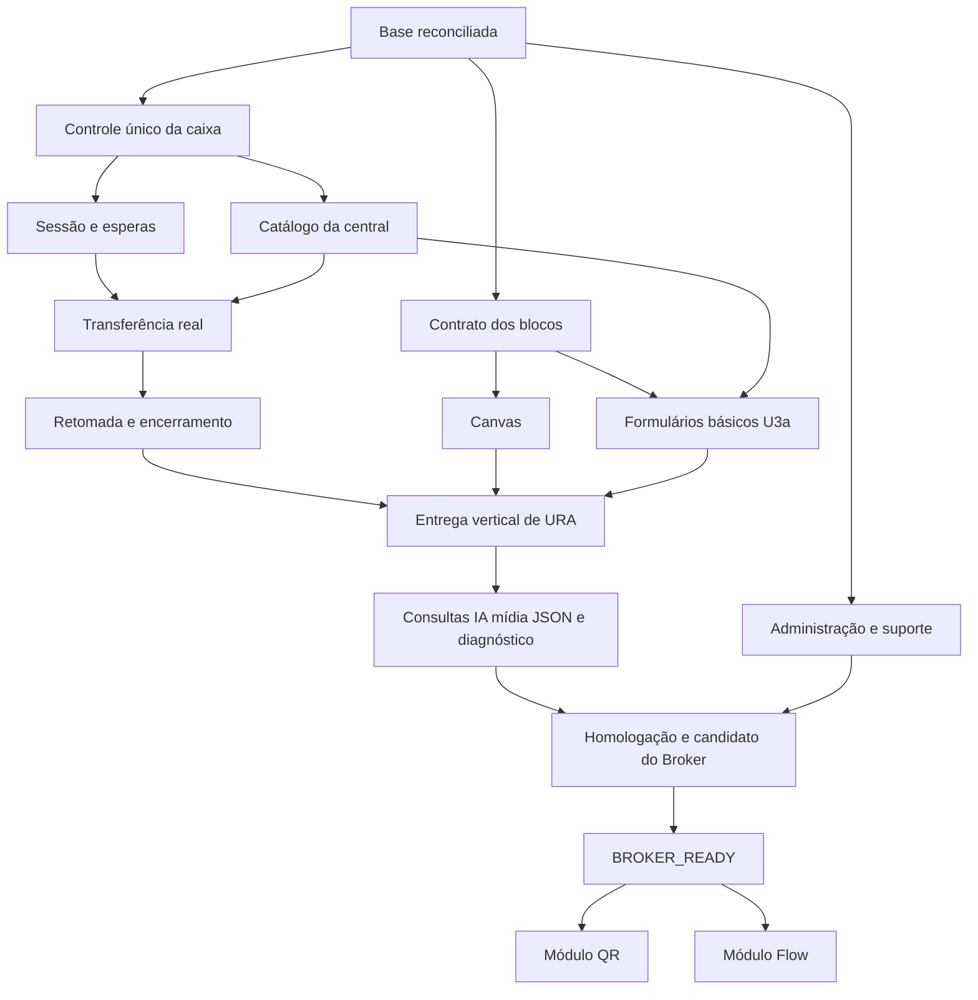

# Conclusão do Broker antes dos módulos Flow e QR — plano de implementação

> **Para execução por agentes:** usar `superpowers:subagent-driven-development` ou `superpowers:executing-plans`, uma tarefa revisável por vez. As caixas abaixo registram trabalho futuro; não são evidência de entrega.

**Objetivo:** finalizar a operação comercial e técnica do Broker para conectar WhatsApp, configurar JRC Conversas/Chatwoot, criar bots de atendimento e operar o ciclo bot → time → humano → encerramento.

**Arquitetura:** o Broker é o motor e o console de configuração. A central fornece a Account, caixas e atendimento humano. Contratos e serviços únicos atendem o console atual; os módulos embutidos usarão esses mesmos serviços somente depois do marco BROKER_READY.

**Stack:** TypeScript, React, Zod, PostgreSQL, Redis, workers existentes, Vitest, Playwright e Docker/Dokploy. Runtime fixado pelo repositório: Node 24.19.0; usar lockfile, sem atualização geral de dependências neste programa.

**Especificação:** [Broker primeiro — escopo](../specs/2026-09-29-broker-first-completion-design.md).
**Base de evidência:** 9466f6a mais mudanças locais de canvas, sem nova consulta da main/produção nesta revisão.
**Data:** 29/09/2026.

## Restrições globais

- Concluir e homologar o Broker independente; depois construir os módulos Flow e QR dentro de JRC Conversas/Chatwoot.
- Um único executor de bot por caixa.
- Não apagar automaticamente Account, Inbox, histórico remoto ou WABA ao excluir no Broker.
- Cada nova alteração deve verificar papel atual e empresa/caixa.
- Não há execução de JSON arbitrário nem promessa de equivalência integral n8n.
- Não há deploy de produção ou exclusão de recursos reais como parte da execução de testes.
- Nenhum segredo, payload de cliente, telefone real ou estado de autenticação entra em Git.
- Reutilizar os controles existentes; não reescrever funcionalidades entregues sem uma falha demonstrada.

## Foco da revisão

1. Duas mensagens rápidas durante execução: uma sessão, consumo ordenado, nenhuma resposta perdida — R2.
2. Humano assume durante I/O ou envio: invalidar efeito automático antes do envio, sem retorno espontâneo ao bot — R4/R5.
3. Caixa, time ou credencial muda depois da publicação: rejeitar referência obsoleta com diagnóstico e contingência — R1/R3/U4.
4. Papel da pessoa é revogado com editor aberto: negar próximo salvar/publicar/ativar, inclusive na API — A3/U3.
5. Exclusão falha no provedor ou encontra recurso compartilhado: manter operação recuperável, sem apagar outra empresa e sem falso sucesso — A2.

## Documentos executáveis

| Plano | Tarefas | Entrega |
| --- | --- | --- |
| [Runtime e atendimento](2026-09-29-broker-runtime-atendimento.md) | R1–R8 | Sessão correta, integração humana, blocos e execução confiável |
| [Studio e jornadas](2026-09-29-broker-studio-e-jornadas.md) | U1–U7 | Editor funcional, configuração guiada, testes, JSON e UX |
| [Administração e release](2026-09-29-broker-administracao-release.md) | A1–A8 | Grupos/empresas, suporte, lifecycle, limites, canais e homologação |
| Este documento | B0, marcos e E1–E4 | Base, coordenação, conclusão do Broker e módulos posteriores |

Os planos antigos continuam como histórico/insumos. **A ordem deste programa prevalece** sobre qualquer roteiro anterior que começava pelo módulo do host, delegação A1/A2 ou conversão ampla n8n.

## O que já existe e deve ser aproveitado

| Área | Código existente | Trabalho deste programa |
| --- | --- | --- |
| Conta/canal/caixa | Destinos, conta, API Inbox, QR e espelhamento | Completar diagnóstico, compatibilidade e jornada real |
| Automações | Rascunho, versão, binding, worker e outbox | Corrigir sessão/esperas, completar blocos e atendimento |
| Suporte | Chamados empresa ↔ equipe JRC com histórico | Homologar jornada e corrigir lacunas demonstradas |
| Exclusão | Prévia, confirmação, operação e lifecycle-worker | Validar casos remotos/parciais, grupos e UX |
| Grupos | Criar/listar/vincular empresas | Renomear, reorganizar e excluir com impacto explícito |
| Planos/acessos | Papéis, módulos e limites | Matriz de permissões e aplicação uniforme |
| CI/release | Build, testes, imagens, migração e restore | Usar os gates com evidência da nova release |

Estado “existente” significa encontrado no checkout, não comprovação da produção. A correção local de canvas preserva seus arquivos atuais e passa por U2; não recriar do zero.

## B0 — reconciliar base, escopo e evidência

**Arquivos:** ler `AGENTS.md`, `package.json`, `.github/workflows/ci.yml`, `.github/workflows/images.yml`; preservar mudanças em `apps/web/src/flows/FlowCanvas.tsx`, `FlowCanvas.test.tsx`, `apps/web/src/pages/AutomationStudio.tsx`. Criar `docs/validation/broker-first-baseline.md`.

**Interface produzida:** inventário com commit base, arquivos locais preservados, migrations presentes, scripts/ambiente e classificação por capacidade: EXISTING, GAP, NEEDS_EXTERNAL_VALIDATION. Não reutilizar “passou” de relatório antigo como execução nova.

- [ ] Registrar `git status --short --ignore-submodules`, branch, HEAD e diferenças locais; identificar checkout reutilizável e ausência de outra execução concorrente.
- [ ] Conferir main remota/PR integrado antes de nova branch `codex/`; transportar a correção local sem sobrescrever trabalho. Se Git remoto estiver indisponível, registrar base e resolver a integração antes de promover uma release.
- [ ] Reservar migrations novas em ordem após a última real. A base inspecionada termina em 0033; não distribuir o mesmo número para trabalhos paralelos.
- [ ] Executar baseline `npm test`, `npm run typecheck` e `npm run build`; registrar ambiente e falhas. Não aumentar timeout para ocultar defeito.
- [ ] Registrar itens externos ainda sem prova: destino JRC, Chatwoot externo, número piloto QR, App/WABA Meta e capacidade operacional alvo.
- [ ] Aceitar B0 quando base, preservação de alterações e comandos reproduzíveis estiverem documentados.

## Ordem e dependências

Dependências detalhadas estão em cada tarefa. Paralelizar somente unidades sem disputa de migrations/contratos; root integra contratos antes dos consumidores. Não iniciar desenvolvimento no repositório JRC para adiantar os módulos.

## Marcos de entrega

### M1 — transporte configurável no Broker

B0, R1/R3, U4a e aceite de transporte A5. Empresa escolhe central, conecta número, cria/adota caixa API, configura membros e verifica entrada/resposta. Não chamar “bot pronto”.

### M2 — primeira URA completa

R2/R4/R5, U1/U2/U3a/U4b. Cliente monta saudação → menu → captura → time. Duas conversas simultâneas funcionam; humano assume e o bot para; encerramento/retomada e ordenação mensagem → transferência têm comportamento comprovado.

### M3 — construtor de atendimento completo no escopo

R6/R7/R8, U3b/U5/U6/U7. Mídia suportada, horários/silêncio, etiquetas/atributos/notas, consulta HTTP, IA delimitada, JSON JRC e importação parcial clara. Todos os blocos disponíveis têm formulário e execução demonstrados.

### M4 — operação administrativa e comercial

A1–A4/A6. Grupo/empresa, acesso, plano/limites, suporte e lifecycle sem operação manual de banco. Dados remotos preservados são mostrados na prévia.

### M5 — BROKER_READY

A7/A8, marcos anteriores e matriz abaixo aprovados em homologação. Documentar commit/digests/limitações do candidato à release. Só então iniciar E1–E4. Promoção em produção é tarefa separada, com autorização e verificação próprias; não é requisito oculto para encerrar o planejamento ou homologação.

Nenhum prazo comercial é fixado antes de B0 e da prova vertical M2. A ordem e os critérios são compromissos verificáveis; volume de código atual não é estimativa de esforço restante.

## Matriz final de aceite

| ID | Evidência necessária | Responsável |
| --- | --- | --- |
| G01 | Conta/número/caixa configurados pelo Broker com central JRC e central externa | U4/A5/A8 |
| G02 | Bot visual criado do zero, sem JSON, com transferência humana real | U3/R4/A8 |
| G03 | Dois contatos/duas empresas/duas caixas sem mistura de estado ou acesso | R1/R2/A3 |
| G04 | Corrida com humano, waits de tipos diferentes, reentrega, reinício e ordem de efeitos | R2/R5/R8 |
| G05 | Nova mensagem após resolução e retorno ao bot funcionam conforme política | R5 |
| G06 | Todos os blocos anunciados podem ser configurados, simulados e executados | U1/U3/R6/R7 |
| G07 | Import/export nativo preserva semântica; incompatível não publica | U6 |
| G08 | Grupos, empresas, planos, suporte e exclusões operáveis e isolados | A1–A4 |
| G09 | Uso/limites, estado de dependências e causas de erro são visíveis | A4/A6/U7 |
| G10 | Banco vazio/upgrade, CI, imagem, restauração e rollback verificáveis | A7/A8 |
| G11 | Jornadas externas de mensagem e resposta real com recursos autorizados | A5/A8 |
| G12 | Guia operacional e escopo comercial correspondem ao demonstrado | U7/A8 |

Cada item recebe resultado, data, ambiente, commit, teste/evidência e limitação. `SKIPPED`/bloqueado por credencial não é aprovação. Se Meta não foi homologado, o aceite Meta permanece aberto; uma release QR identifica explicitamente esse recorte.

## Regras de validação e publicação

Por tarefa de produto: teste de regressão falhando → implementação mínima → teste focal passando → revisão de contrato e diff. Antes de commit: `npm test` e `git diff --check --ignore-submodules`, conforme AGENTS. Demais verificações conforme o componente afetado; o gate completo da release permanece obrigatório.

Comandos reais existentes:

- `npm run typecheck`, `npm run build`, `npm run test:web:bundle`.
- `npm run test:integration`: exige PostgreSQL/Redis de laboratório e variáveis previstas pelos helpers.
- `npm run test:e2e`: build web e Playwright contra composição da API de teste.
- `npm run openapi:generate`, `npm run security:contracts`, `npm run security:notices`, `npm run security:submodule`.
- `npm run test:container`, `npm run test:restore-drill`, `npm run security:release`.
- `npm run ci:verify`: gate agregado; não rodar contra banco/recursos de produção.

Deploy: workflow de imagem com evidência do commit, digests API/WEB da mesma revisão, backup, status/migration, aplicação, health e jornadas. Autodeploy desligado durante promoção manual. Preservar stack/volumes. Reversão de aplicação só para artefato compatível com schema/estado; nunca `down -v`.

## Módulos posteriores: planejamento condicionado a BROKER_READY

Estes itens estão planejados, mas **não fazem parte da implementação anterior ao marco**. Revalidar o checkout host e sua versão implantada antes de começar. Base de referência local: `JRCConversas-current-audit-20260925`; não tratá-la como main atual.

### E1 — contrato delegado e catálogo de compatibilidade

- [ ] Consumir os serviços estabilizados R1–R7, sem duplicar runtime.
- [ ] Implementar sessão curta por usuário/Account/Inbox e revalidação por operação; credenciais de Flow separadas de controle QR.
- [ ] Versionar handshake de capacidades e testar instalação, origem, papéis, revogação e incompatibilidade.
- [ ] Ler [A1/A2](../../integrations/jrc-flow-delegation-a1-a2-20260925.md), atualizando o desenho com contratos efetivamente entregues.
- [ ] Aceite: usuário autorizado acessa somente sua caixa; revogado perde a próxima operação; nenhuma chave administrativa no navegador.

### E2 — módulo QR dentro da central

- [ ] Reutilizar controle/onboarding do Broker: criar/adotar conexão, desafio temporário, expiração, confirmação de identidade, status e reconexão.
- [ ] JRC nativo: menus e BFF próprios; Chatwoot padrão: Dashboard App quando suportado, com limites de localização claros. Wizard global exige extensão instalada.
- [ ] Tratar dupla solicitação, QR atrasado, fechamento de tela, troca de Account e revogação.
- [ ] Aceite: conectar/reconectar sem copiar segredo, sem abrir conversa artificial e sem criar conexão/caixa duplicada; desligar módulo não exclui histórico.

### E3 — módulo Flow dentro da central

- [ ] Abrir o mesmo rascunho/grafo do Broker, com revisão concorrente e catálogo da caixa.
- [ ] Criar, editar, simular, publicar e ativar pelos serviços existentes; papéis e limites iguais aos do console.
- [ ] Mostrar fonte de edição e versão; atualizar em um portal deve refletir no outro sem exportação manual.
- [ ] Aceite: mesma automação editada nos dois portais, conflito de revisão explicado e ativação sem segundo bot.

### E4 — adoção/migração e homologação dos módulos

- [ ] Inventariar Flow local/AgentBot/bot externo por caixa, propor migração com prévia e corte por versão; não ativar dois.
- [ ] Testar atualização/desinstalação/revogação, rollback do conector, perda de rede e retenção do histórico.
- [ ] Homologar build real JRC e versões/forks Chatwoot anunciados. Canal nativo da central exige adaptador de eventos/saída próprio, com seus testes.
- [ ] Publicar documentação e release separadas dos módulos, vinculadas à versão compatível do Broker.

## Checklist de cobertura da conversa

| Solicitação do usuário | Tarefas |
| --- | --- |
| Suporte recebido pela administração | A3, U7 |
| Grupo JRC com GoPure/Operadora/Construtora e exclusão/reorganização | A1/A2 |
| Excluir empresa inteira e conexão | A2 |
| Configurar central própria ou JRC e caixa | R3/U4/A5 |
| Bot/URA low-code funcional | R2/R4/R5/R6/U1/U2/U3 |
| Arrastar/zoom/navegação | U2 |
| Time/agente/fila, humano e retorno | R3/R4/R5 |
| JSON gerado por IA e importação n8n | U6 |
| Consultas, IA e contexto de atendimento | R7/U3 |
| Planos/limites/uso e funcionamento comercial | A4/A6 |
| Logs, falhas, testes e deploy | R8/U5/U7/A7/A8 |
| Módulos Flow e QR somente depois do Broker | E1–E4 após G01–G12 |

## Estado desta entrega de planejamento

Especificação e planos escritos com base no código e nas decisões da conversa. Nenhuma tarefa de produto marcada como concluída por existir neste documento. Nenhuma configuração de servidor, bot, webhook ou recurso de cliente foi alterada para preparar o plano.
